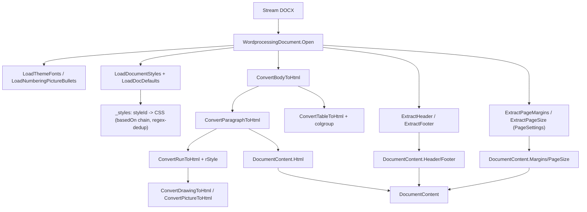
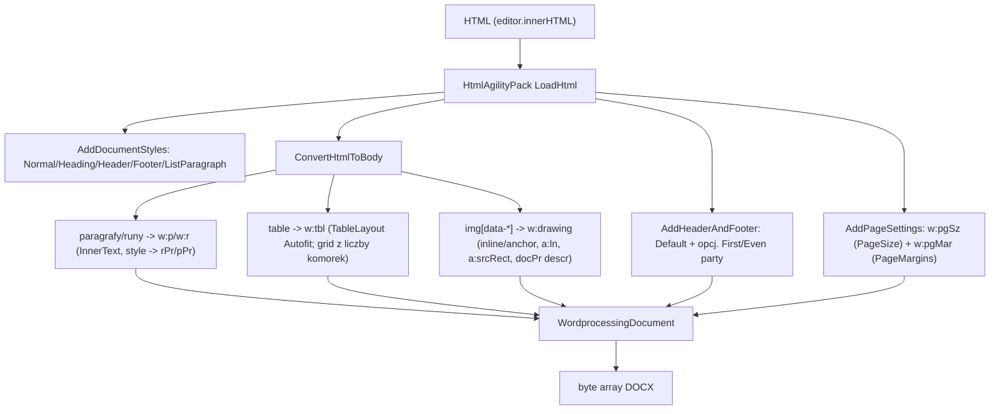
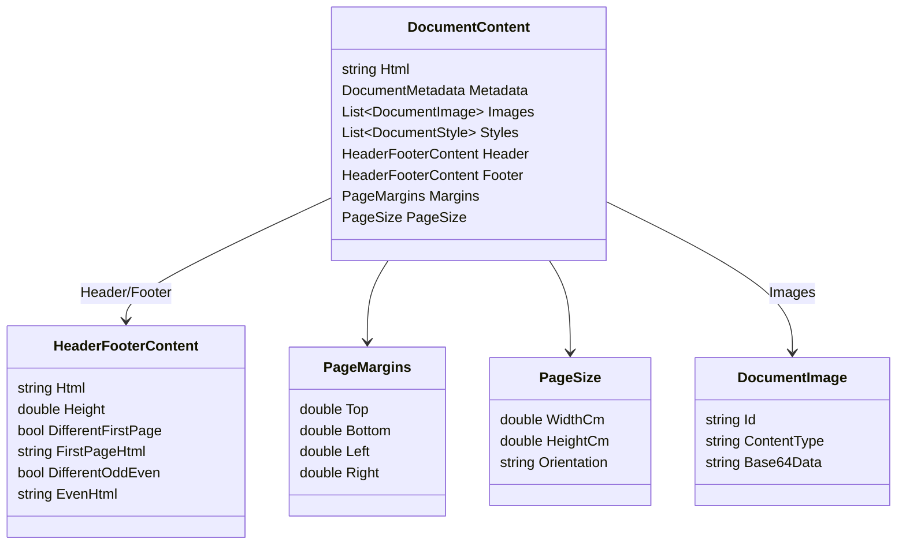

# DOCX ↔ HTML Conversion — reference techniczny

> Źródło prawdy o konwersji dokumentów w D2 ViewerEditor. Każdy fakt zweryfikowany w kodzie
> (ścieżki podane). Statusy oznaczone jawnie. Dokument komplementarny do:
> - `FEATURES.md` (sekcja nagłówek/stopka — opis funkcjonalny),
> - `FIDELITY_REPORT.md` (macierz wierności z Wordem),
> - `RISKS_ASSUMPTIONS.md` (R-10..R-14),
> - `DECISIONS.md` (ADR-0008 jednostki/harness, ADR-0009 model pośredni).
>
> Ostatnia weryfikacja względem kodu: 2026-06-03.

## 1. Przegląd

Konwersja jest dwukierunkowa i w pełni własna (parser/generator OOXML na bazie
`DocumentFormat.OpenXml` 3.0.2 — bez zewnętrznego renderera):

| Kierunek | Klasa | Plik | Kontrakt |
|---|---|---|---|
| DOCX → HTML (import/render) | `DocxToHtmlConverter` | `D2ViewerEditor.Infrastructure/Services/DocxToHtmlConverter.cs` | `IDocxToHtmlConverter.Convert(Stream) : DocumentContent` |
| HTML → DOCX (zapis/eksport) | `HtmlToDocxConverter` | `D2ViewerEditor.Infrastructure/Services/HtmlToDocxConverter.cs` | `IHtmlToDocxConverter.Convert(string html, …, PageMargins?, PageSize?) : byte[]` |

Interfejsy: `D2ViewerEditor.Domain/Interfaces/IDocxToHtmlConverter.cs`,
`IHtmlToDocxConverter.cs`. Warstwy pomocnicze:

- **Jednostki**: `D2ViewerEditor.Infrastructure/Conversion/OoxmlUnits.cs` — jedno źródło prawdy
  dla twips/EMU/half-points/cm/px (DPI 96). Patrz ADR-0008.
- **Model pośredni (read-side, częściowy)**: `D2ViewerEditor.Infrastructure/DocxModel/`
  (`PageSettings`, `SectionPropertiesReader`) — geometria sekcji/strony. Patrz ADR-0009.

> Architektura jest hybrydą: parsowanie sekcji/strony idzie przez jawny model
> (`PageSettings`), reszta (akapit/run/tabela/obraz) wciąż konwertuje **XML → string HTML**
> jednym przebiegiem metodami `Convert*ToHtml`. Pełny model pośredni jest wprowadzany
> strangler-pattern (ADR-0009) — nie jest kompletny.

### Pipeline DOCX → HTML



### Pipeline HTML → DOCX



## 2. Model `DocumentContent`

Definicja: `D2ViewerEditor.Domain/Models/DocumentModels.cs`. Odpowiednik TS:
`D2GuiViewerEditor/src/app/models/document.model.ts`.



**Ograniczenie modelu (R-10, stan po ADR-0023 z 2026-07-05):** `DocumentContent` niesie
**jeden komplet** pól sekcyjnych — jeden `Header`, jeden `Footer`, jedne `Margins`, jeden
`PageSize` (wszystko z **PIERWSZEJ** sekcji dokumentu, `GetSectionPropertiesInDocumentOrder`)
i jeden ciąg `Html`. Warianty first-page / even-odd są wspierane w obrębie tego kompletu
(pola `DifferentFirstPage`/`FirstPageHtml`/`DifferentOddEven`/`EvenHtml`). **Wiele sekcji jest
reprezentowane w `Html`**: przerwa sekcji → `div.page-break` + niewidoczny marker
`div.docx-section-break` z geometrią następnej sekcji w `data-*`; writer odtwarza z markerów
paragraph-level `w:sectPr` (body-level = ostatnia sekcja), a refs nagłówka/stopki + `titlePg`
kładzie na pierwszym sectPr (dziedziczenie). **Nadal jedno-kompletowe pozostają
nagłówki/stopki per sekcja** (różne nagłówki 2. i kolejnych sekcji nie są modelowane).

Docelowe rozszerzenie (Planned / not implemented yet): osobne referencje header/footer
(default/first/even) per sekcja w modelu + UI edycji nagłówków per sekcja.

## 3. Jednostki (`OoxmlUnits`) — Implemented

`D2ViewerEditor.Infrastructure/Conversion/OoxmlUnits.cs`. Jedno źródło prawdy; nazwane
stałe (`TwipsPerInch=1440`, `EmuPerInch=914400`, `EmuPerPixel=9525`, `TwipsPerPoint=20`,
`HalfPointsPerPoint=2`, `DefaultDpi=96`, `CmPerInch=2.54`). Oba konwertery używają go
zamiast rozproszonych stałych (reguła 14). Testy: `Conversion/OoxmlUnitsTests.cs`
(1 cal = 1440 tw = 914400 EMU = 96 px = 72 pt = 2.54 cm). Patrz ADR-0008.

## 4. Macierz statusów (zweryfikowane w kodzie)

Statusy: `Implemented` / `Partially implemented` / `Planned / not implemented yet`.
Kierunek: R = DOCX→HTML (read), W = HTML→DOCX (write).

| Obszar | Status | Kier. | Gdzie w kodzie | Uwagi / ograniczenia |
|---|---|---|---|---|
| Jednostki (twips/EMU/half-pt/cm/px) | Implemented | R+W | `OoxmlUnits` | DPI 96; testy referencyjne |
| Marginesy strony | Implemented | R+W | `ExtractPageMargins`; `AddPageSettings` | cm, round-trip |
| Rozmiar strony + orientacja | Implemented | R+W | `ExtractPageSize`; `BuildPageSize` | full-stack (Etap 4); fallback A4 |
| Sekcje — wiele sekcji | Implemented (data + rendering geometrii) | R+W | `GetSectionPropertiesInDocumentOrder`, `BuildSectionBreakMarkerHtml`; writer `CreateSectionBreakParagraph`/`AppendSectionGeometry`; GUI `wysiwyg-editor` `pageGeometries`/`_parseSectionGeometry` | ADR-0023 (2026-07-05): geometria+nagłówki z PIERWSZEJ sekcji; przerwy sekcji → markery `div.docx-section-break` (data-*) round-tripowane do paragraph-level sectPr; refs nagłówka/stopki na pierwszym sectPr. Edytor renderuje strony w geometrii SWOJEJ sekcji (wymiary/orientacja/marginesy per strona z markerów; input `pageSize` dla sekcji 1). Nagłówki/stopki per sekcja: nadal jeden komplet (model) |
| Nagłówek/stopka default | Implemented | R+W | `ExtractHeader/Footer`; `AddHeaderAndFooter` | wybór wg `sectPr` referencji |
| First-page / even-odd header/footer | Implemented | R+W | `HasTitlePage`/`HasEvenAndOddHeaders` | w obrębie 1 sekcji; edycja even-page z UI niedostępna |
| Nagłówki/stopki per sekcja | Implemented | R+W | `ExtractSectionHeadersFooters`; writer `AddSectionHeadersFooters` | ADR-0025 (2026-07-05): `DocumentContent.SectionHeadersFooters` (wpisy dla sekcji ≥ 1 z własnymi refs; dziedziczenie jak Word); GUI renderuje per strona (`pageSectionIndexes`) i edytuje na klikniętej stronie; Sign nie przenosi (odłożone) |
| Styl akapitu (`basedOn` chain) | Implemented | R | `ConvertStyleToCssWithInheritance` | sklejanie stringów CSS + `DeduplicateCss` (regex) |
| Styl znakowy (`w:rStyle`) | Implemented | R | `ConvertRunToHtml` (`_styles[rStyleId]`) | Etap 3 slice; direct wygrywa |
| docDefaults | Partially implemented | R | `LoadDocDefaults` | tylko domyślny font + rozmiar; nie pełny rPr/pPr folding |
| Linked styles | Partially implemented | R | `_styles` per styl | brak jawnego łączenia paragraph↔character |
| Numbering (listy) | Partially implemented | R | `LoadNumberingPictureBullets`, list rendering | listy renderowane; numbering **styles** nie foldowane w computed-style |
| Theme fonts / colors | Implemented | R | `GetFontName`, `ResolveThemeColor` | asciiTheme/minor/major; auto color |
| Font generic fallback (CSS) | Implemented | R | `FontFamilyCss`/`GenericFontFallback` | nazwa kroju + dobrany generyk: serif (times/cambria/georgia/garamond/palatino/…) / monospace (courier/consolas/mono) / sans-serif; brakujący krój renderuje się we właściwej rodzinie (nie zawsze sans) |
| Computed-style (jeden obiekt) | Planned / not implemented yet | R | — | brak `ComputedParagraph/RunStyle`; kaskada CSS |
| Typografia bezpośrednia | Implemented | R+W | `GetRunStyleClean`/`ConvertRunPropertiesToCss` | bold/italic/underline/strike/color/size/highlight/sub-sup/letter-spacing |
| Akapit: align/indent/spacing/line | Implemented | R+W | `ConvertParagraphPropertiesToCss`; writer pPr | exact/atLeast/auto line spacing; 2026-07-05: reguła `atLeast` round-tripowana markerem CSS `--w-line-rule:atLeast` (wcześniej wracała jako `exact` → przycinanie w Wordzie) |
| Tabela: szerokości kolumn | Implemented | R | `ReadTableGridColumnsPx`/`BuildColgroupHtml` | `<colgroup>` + `table-layout:fixed` (Etap 5); GUI synchronizuje colgroup po resize/wstawieniu/usunięciu kolumny (`table-grid.util.syncTableColgroup`) |
| Tabela: **styl tabeli** (`tblStyle`+`basedOn`+`tblLook`+`tblStylePr`) | Implemented | R+W | `ResolveTableStyleContext`, `ComputeConditionalRegions`; writer emituje `w:tblStyle`/`w:tblLook` z `data-tbl-style`/`data-tbl-look` | ADR-0026 (2026-07-05): obramowania/cieniowanie/cellMar ze stylu (łańcuch basedOn) + formaty warunkowe firstRow/lastRow/firstCol/lastCol/pasy wg flag tblLook (banding pomija wiersz nagłówkowy jak Word); rozwiązane wartości idą w inline CSS (po round-tripie stają się formatowaniem bezpośrednim — kontrolowane przybliżenie), referencja stylu przeżywa w data-*. NIE: warunkowe formatowanie TEKSTU (bold nagłówka ze stylu), regiony narożne NW/NE/SW/SE |
| Tabela: borders / shading | Implemented | R | `GetTableCellStyleDetailed`, `ResolveCellBorderSide`, `ResolveShadingHex` | Pozycyjne krawędzie: zewnętrzne top/bottom/left/right vs `insideH`/`insideV` wg pozycji komórki w siatce (wcześniej zewnętrzne szły na WSZYSTKIE krawędzie); `themeFill`/`themeColor`+tint/shade rozwiązywane przez motyw; wzory `pctNN` przybliżane blendem koloru; grubość `sz/6` px (0.5 pt = 0.7px; wcześniej sz/8+min 1px pogrubiało linie przy każdym zapisie). NIE: przekątne `tl2br`/`tr2bl` |
| Tabela: `tcMar` / `tblCellMar` | Implemented | R+W | `GetTableCellStyleDetailed`, `TableCellMarginDefault`; writer `tblCellMar` 0/108 | domyślny padding: bezpośredni tblCellMar → styl tabeli → Word default (top/bottom **0**, left/right 108 tw) |
| Tabela: `tblCellSpacing` | Implemented | R+W | reader → `border-collapse:separate`+`border-spacing` + `data-cell-spacing-tw`; writer → `w:tblCellSpacing` | 2026-07-05 |
| Tabela: `gridSpan`/`vMerge` | Implemented | R | `AppendTableCellHtml`, `CountRowSpan` | fix dopasowania wg kolumny gridu (Etap 5); kursor siatki śledzi pozycję (kontynuacje vMerge zajmują kolumny). 2026-07-06: **wiersze nieregularne (krótkie)** — gdy Σ gridSpan wiersza < liczba kolumn siatki, ostatnia komórka pochłania deficyt (`colspan`); bez tego pojedyncza scalona komórka lądowała w 1. wąskiej kolumnie (`table-layout:fixed`) — wada „Doc2" |
| Tabela: wysokość wiersza (`trHeight`+`hRule`) | Implemented | R+W | reader: `height:` na tr + `data-row-height-tw`/`data-row-hrule`; writer preferuje data-* | `min-height` na `<tr>` jest ignorowane przez przeglądarki (atLeast traciło wysokość); `hRule=exact` przeżywa round-trip; GUI NIE zapieka już mierzonych wysokości wszystkich wierszy (R-18 zamknięte), ręczny resize czyści data-* |
| Tabela: `tblHeader`/`cantSplit` | Implemented (round-trip) | R+W | `data-tbl-header`/`data-cant-split` na tr ↔ `w:tblHeader`/`w:cantSplit` | edytor NIE powtarza wiersza nagłówkowego przy paginacji ani nie honoruje cantSplit w łamaniu (tylko round-trip danych) |
| Tabela: szerokość (zapis) | Implemented | W | writer table-width path | brak/auto width → `tblW auto` (nie `pct 5000`); `%`→pct (z ułamkiem, np. 66.66%→3333), `px`→dxa; `w:tblInd` (margin-left px) round-trip; szerokość komórki auto/nil (w=0) nie emituje już `width:0px` |
| Tabela (zapis) — grid/layout/vMerge | Implemented | W | `ReadColgroupWidthsTwips`, `CreateVerticalMergeContinuationCell` | 2026-07-05: `tblGrid` z colgroup (px→twips), `table-layout:fixed`→`TableLayout Fixed`, komórki kontynuacji `vMerge` pod rowspan (pozycjonowanie po kolumnie gridu). Testy `TableWriteFidelityTests` |
| Tabela: zagnieżdżone | Implemented | R+W | reader rekurencyjnie; writer `./tr|./thead/tr|./tbody/tr|./tfoot/tr` | 2026-07-05: `.//tr` na tabeli zewnętrznej łapało wiersze tabel ZAGNIEŻDŻONYCH (duplikacja) |
| Obraz: rozmiar/EMU/proporcje | Implemented | R+W | `ConvertDrawingToHtml`; writer image path | `data-*-emu` round-trip |
| Obraz: inline + floating (`wp:anchor`) | Implemented | R+W | anchor read/write | front/behind + offsety |
| Obraz: border (`a:ln`) | Implemented | R+W | `data-border-*` ↔ `a:ln` | solid/dashed/dotted |
| Obraz: crop (`a:srcRect`) | Partially implemented | R+W | `data-crop-*` ↔ `a:srcRect` | display `clip-path: inset()` — **nie skaluje** do boxa jak Word |
| Obraz: alt text | Implemented | R+W | `wp:docPr/@descr` ↔ `` | `DeEntitize` po stronie zapisu (Etap 6) |
| Obraz: rotacja (`a:xfrm/@rot`) | Planned / not implemented yet | R+W | — | brak odczytu/zapisu; bounding box bez obrotu |
| Obraz: VML / legacy shapes | Partially implemented | R | `ConvertPictureToHtml` (VML ImageData) | tylko obraz + rozmiar; brak border/crop/alt/rot dla VML |
| Tab-stopy: render L⇥C⇥R | Implemented | R | `GetEffectiveTabStops`, `BuildPositionedTabContent`; fallback `_flexTabs` | 2026-07-06: `w:tabs` → segmenty POZYCYJNE na pozycjach stopów (`span.docx-tab-seg`, lewy=start NA pozycji, center `translateX(-50%)`, right `translateX(-100%)`) w nagłówku/stopce **ORAZ w body** (wcześniej body szło flexem 50/100% ignorującym realne pozycje — wada „Doc2"); flex tylko gdy tab bez rozwiązywalnych pozycji; efektywne stopy = łańcuch stylów + direct pPr (semantyka clear) |
| Tab-stopy: zapis `w:tabs` | Implemented | W | `ParseTabStops` (`data-tab-stops`), `CreateRunsFromNode` | 2026-07-05: pozycje/wyrównania/leadery round-tripowane PER AKAPIT (`data-tab-stops="pos:align[:leader]"`); `span.docx-tab-seg`→`w:tab`; literalny `	` w tekście → element `w:tab` (nie `w:t`); style Header/Footer 4536/9072 zostają jako default |
| Hyperlinki | Implemented | R | `ConvertHyperlinkToHtml` | |
| Pola: data | Partially implemented | R | `ConvertSimpleFieldToHtml`, complex fields | `DateTime.Now` (dynamiczne, nie wartość z DOCX) |
| Pola: numery stron | Partially implemented | R+W | `FieldSpan` (R); `BuildFieldRun` → `w:fldSimple`+inner run (W); front `_pageNumberHtml` | placeholder/edycja; brak realnej paginacji. **Font-size pola zachowany**: reader niesie rPr runu na `.field-page/.field-numpages`; writer odtwarza rPr w wewnętrznym runie `fldSimple`; wstawiany `.page-number` dziedziczy font-size stopki (CSS `font-size:inherit`) |

## 5. Roadmapa konwersji (wymagane obszary)

### R-10 — wiele sekcji z różnymi nagłówkami/stopkami

- **Status:** w dużej mierze **Implemented** (ADR-0023, 2026-07-05) — geometria per sekcja
  round-tripowana i renderowana; **Open pozostają nagłówki/stopki RÓŻNE per sekcja**.
- **Kod (read):** `GetSectionPropertiesInDocumentOrder` — sekcje w kolejności dokumentu;
  `PageSize`/`Margins`/nagłówek/stopka z PIERWSZEJ sekcji (pułapka: body-level `sectPr` to
  OSTATNIA sekcja); przerwy sekcji → `div.page-break` + marker `div.docx-section-break`
  (`BuildSectionBreakMarkerHtml`, geometria następnej sekcji w `data-*`).
- **Kod (write):** `CreateSectionBreakParagraph`/`AppendSectionGeometry` — markery →
  paragraph-level `w:sectPr`; refs nagłówka/stopki + `titlePg` na pierwszym sectPr;
  `page-break` przed markerem nie emituje `w:br`.
- **GUI:** `wysiwyg-editor` — `pageGeometries` per strona (sekcja 1 z inputów `pageSize`,
  kolejne z `data-*` markera); repaginacja wg wymiarów bieżącej sekcji; scss ukrywa marker.
- **Ograniczenia (Open):** nagłówki/stopki wspólne dla wszystkich sekcji (model
  jedno-kompletowy); marker jest elementem contenteditable — użytkownik może go skasować
  edycją przy granicy sekcji (degradacja do jednej sekcji).
- **Testy:** `MultiSectionFidelityTests` (12), test przeżywalności markera w
  `wysiwyg-editor.spec` (+6 testów geometrii per strona).

### Etap 3 — pełny computed-style

- **Status:** `Partially implemented`. Działa: `basedOn` (akapit), `w:rStyle` (znakowy),
  theme fonts/colors, docDefaults (font/rozmiar). Brak: jeden centralny resolver zwracający
  `ComputedParagraphStyle`/`ComputedRunStyle`; folding pełnych docDefaults do każdego
  elementu; numbering styles; linked styles jako pary.
- **Kod:** `ConvertStyleToCssWithInheritance` (+`DeduplicateCss` regex), `LoadDocDefaults`,
  `ResolveThemeColor`, `GetFontName`, `ConvertRunToHtml` (rStyle). Brak typu computed-style.
- **Ograniczenie:** rozwiązywanie stylów to **sklejanie stringów CSS + dedup regexem** i
  poleganie na kaskadzie CSS — kruche dla złożonych łańcuchów i numbering/theme.
- **Kierunek docelowy (Planned / not implemented yet):** centralny `StyleResolver`
  (docDefaults → styl akapitu `basedOn` → linked character style → numbering style →
  direct formatting → theme/auto color) zwracający jawny computed-style; renderer emituje CSS
  z computed-style (eliminacja regex-dedup). Dotyczy głównie **R**.
- **Testy zabezpieczające:** dziedziczenie (`basedOn` łańcuch), direct nadpisujący bazę,
  theme color/font, auto color, dokument z numbering + theme (regresja).

### Domknięcia (technical debt)

| # | Temat | Status | Kier. | Kod | Ograniczenie / next step |
|---|---|---|---|---|---|
| 6 | Rotacja obrazów (`a:xfrm/@rot`) | Planned / not implemented yet | R+W | — | brak odczytu/zapisu rotacji; next: czytać `rot` (1/60000°) → `transform:rotate()` + `data-rot`, writer odwrotnie; uwzględnić bounding box |
| 6 | VML / legacy obrazy | Partially implemented | R | `ConvertPictureToHtml` | tylko obraz+rozmiar; brak border/crop/alt/rot; obrazy VML w nagłówkach/stopkach jak zwykłe |
| 5 | `tcMar` (marginesy komórek) | Implemented | R | `GetTableCellStyleDetailed` | mapowane na `padding`; OK |
| 5 | `tblCellSpacing` | Planned / not implemented yet | R | — | nieczytane; wymaga `border-collapse:separate; border-spacing` (kolizja z obecnym `collapse`) |
| 7 | `w:tabs` na zapisie | Partially implemented | W | `AddDocumentStyles` | tab-stopy center/right tylko w **stylach Header/Footer** (pozycje 4536/9072 tw); per-akapit/custom nieprzenoszone; znak taba zachowany jako tekst |

## 6. Harness regresji i testy

Lokalizacja: `D2ViewerEditor.Infrastructure.UnitTests/`.

- **Golden/** — deterministyczne DOCX in-memory (`GoldenDocuments`) + snapshoty HTML
  (`HtmlSnapshot`, approve-on-missing, normalizacja base64/`data-image-id`/dat) +
  `GoldenSnapshotTests` z asercjami punktowymi (jednostki, geometria, tabele, tab-stopy,
  styl znakowy). Patrz ADR-0008.
- **Conversion/OoxmlUnitsTests** — wartości referencyjne jednostek.
- **DocxModel/SectionPropertiesReaderTests** — model sekcji/strony.
- **Services/** round-tripy: `PageSizeRoundTripTests`, `ImageAltTextRoundTripTests`,
  `ImageBorderCropRoundTripTests`, `ImageFloatingRoundTripTests`, `HeaderFooterRoundTripTests`,
  `DocxToHtmlConverterFidelityTests`, `DocxToHtmlConverterHeaderFooterTests`,
  `DocxToHtmlConverterSectionReferenceTests`.

Uruchomienie:
```bash
dotnet test D2ApiViewerEditor/D2ViewerEditor.sln
```
Stan na 2026-06-03: backend **358 pass / 0 fail / 6 skip**, GUI **166 pass**.

> Uwaga: snapshoty Golden lokują **obecne** wyjście HTML (regression-guard), nie poprawność
> pikselową wobec Worda (R-12). Po świadomej poprawie wierności baseline aktualizować
> (`delete *.approved.html` + re-run) i przeglądać diff.

## 6a. Round-trip layout — regresja (orginał_GOOD vs zapisany_BAD)

Analiza dwóch realnych plików (kontrakt sprzedaży, 4 strony) ujawniła rozjazd round-tripu
(4→7 stron, powiększone tabele). Naprawione **źródłowo** (2026-06-03):

| Root cause | Fix | Plik |
|---|---|---|
| Marginesy napompowane `Math.Max(top, headerH+720)` + hardkod Header/Footer=720 | marginesy jak autorskie; `Header/Footer = clamp(margin−band, 0, 720)` | `HtmlToDocxConverter.AddPageSettings` |
| Każda komórka +4px góra/dół (`tcMar` 60 tw) | domyślny padding = Word default 0/108 | `DocxToHtmlConverter.ConvertTableToHtml` |
| Tabele rozciągane do 100% (`tblW pct 5000`) | brak/auto width → `tblW auto` | `HtmlToDocxConverter` (table-width) |
| Tabelowy `tblCellMar` 40/80 | Word default 0/108 | `HtmlToDocxConverter` (TableCellMarginDefault) |
| +2 twarde page-breaki z auto-paginacji edytora | `getContent()` scala strony bez `page-break` div | `wysiwyg-editor.ts` |

Weryfikacja (reader→writer na realnym pliku): top 567 / bottom 850 / header 6 / footer 339 /
`tblW auto` / `tcMar` góra+dół 0 / 0 twardych breaków — **AFTER ≈ GOOD** (BAD miało
1281/1231/720/720, pct 5000, 8160 tw, 3 breaki).

Testy regresji: `Infrastructure.UnitTests/Services/RoundTripLayoutFidelityTests` (marginesy
nie-inflowane, header/footer distance, `tcMar`=0, `tblW` auto na syntetycznych DOCX
odtwarzających strukturę GOOD — bez commitowania realnego pliku) + Vitest
`wysiwyg-editor.spec` (getContent bez `page-break`).

Pozostałe ograniczenia round-tripu: R-15 (1 oryginalny break nieodtworzony), R-16 (model
stratny: `styles.xml`/`numbering.xml`/theme/font Cambria→Calibri), R-17 (split-table → 2
tabele), R-18 (zapiekane `trHeight`).

## 6b. Pass-through pakietu + ręczna weryfikacja (R-15/R-16/R-17)

**Pass-through (R-16, częściowy):** `HtmlToDocxConverter.ConvertPreservingPackage(html, Stream? original, …)`
generuje DOCX jak `Convert`, a następnie zachowuje z oryginalnego pakietu `styles.xml` (pełny
zestaw, w tym style tabel), `theme` i `fontTable` (FeedData). Body/sekcja/nagłówki-stopki/
obrazy/numbering pochodzą z konwersji HTML. Wpięte w `DownloadEditedDocumentCommandHandler`
(ładuje bazową wersję v1 przez `IDocumentStorageService.DownloadAsync`; fallback do `Convert`
gdy brak wersji / nie-DOCX). Status szczegółowy: R-19/R-20/R-21 w `RISKS_ASSUMPTIONS.md`.

| Temat | Status | Plik |
|---|---|---|
| Page break round-trip | `Implemented` | `HtmlToDocxConverter.IsPageBreakNode`/`CreateRunsFromNode` |
| Pass-through styles/theme/fontTable | `Partially implemented` | `HtmlToDocxConverter.ConvertPreservingPackage` (Download path) |
| Pass-through numbering.xml | `Planned / not implemented yet` | — (R-19, konflikt numId) |
| Pass-through w autosave | `Planned / not implemented yet` | — (R-20, ścieżka bezstanowa) |
| Scalanie split-table na zapisie | `Implemented` | `wysiwyg-editor._mergeSplitTables` |

**Generacja `zapisany_AFTER.docx`:** lokalnie, reader → `ConvertPreservingPackage(html, oryginał)`
(test był tymczasowy, niecommitowany). Wynik (reader→writer): styles **164** (=GOOD), theme
**Cambria**, page-breaki **1** (=GOOD).

**Checklista ręcznej weryfikacji w MS Word:**
1. Otwórz `orginał_GOOD.docx` — potwierdź ~4 strony (wzorzec).
2. Otwórz `zapisany_AFTER.docx` — sprawdź:
   - liczba stron ≈ 4 (nie 7),
   - tabele nie są rozciągnięte na 100% / nie urosły w pionie,
   - szerokości kolumn ≈ oryginał,
   - marginesy strony ≈ oryginał (góra wąska, nie 2,3 cm),
   - **font treści szeryfowy (Cambria)**, nie Calibri,
   - manualny page break w tym samym miejscu co w oryginale,
   - nagłówek/stopka na miejscu, nie wypchnięte.
3. (Kontrast) `zapisany_BAD.docx` — 7 stron, Calibri, napompowane tabele.
4. Zapisz odchylenia w raporcie (co nadal różni się od oryginału).

## 7. Ograniczenia trwałe (HTML/CSS)

Nieosiągalne 1:1 w przeglądarce (udokumentowane w `FIDELITY_REPORT.md` §3):
zawijanie tekstu wokół obrazu „przylegle/na wskroś" (tight/through), dokładna paginacja i
podział stron Worda, kerning/metryki czcionek, dynamiczne pola zależne od layoutu
(`PAGE`/`NUMPAGES`). Cel: maksymalna **mierzalna** wierność, nie 100%.

### Font / nawigacja kursora (edytor)
- **Brakujący krój:** reader dobiera *generyczną rodzinę* (serif/monospace/sans-serif) jako
  fallback po nazwie kroju — gdy np. Times New Roman nie jest zainstalowany w przeglądarce,
  tekst renderuje się fontem szeryfowym systemu (nie Calibri/sans). Nie podstawiamy ani nie
  dosadzamy konkretnych plików czcionek (licencje); nazwa kroju pozostaje w CSS i round-tripie.
- **Nawigacja między stronami:** strony to osobne elementy `contenteditable`, więc przeglądarka
  nie przenosi kursora ArrowDown/ArrowUp przez granicę strony. `_tryMoveCaretAcrossPages`
  przenosi go ręcznie, gdy karetka jest zwinięta na skrajnej linii i bez modyfikatorów
  (Shift/zaznaczenia, Ctrl/Alt — nietknięte). Detekcja skrajnej linii (`_isCaretOnEdgeLine`)
  jest layout-zależna (rect karetki) i nieodtwarzalna w jsdom (brak `Range.getClientRects`).
