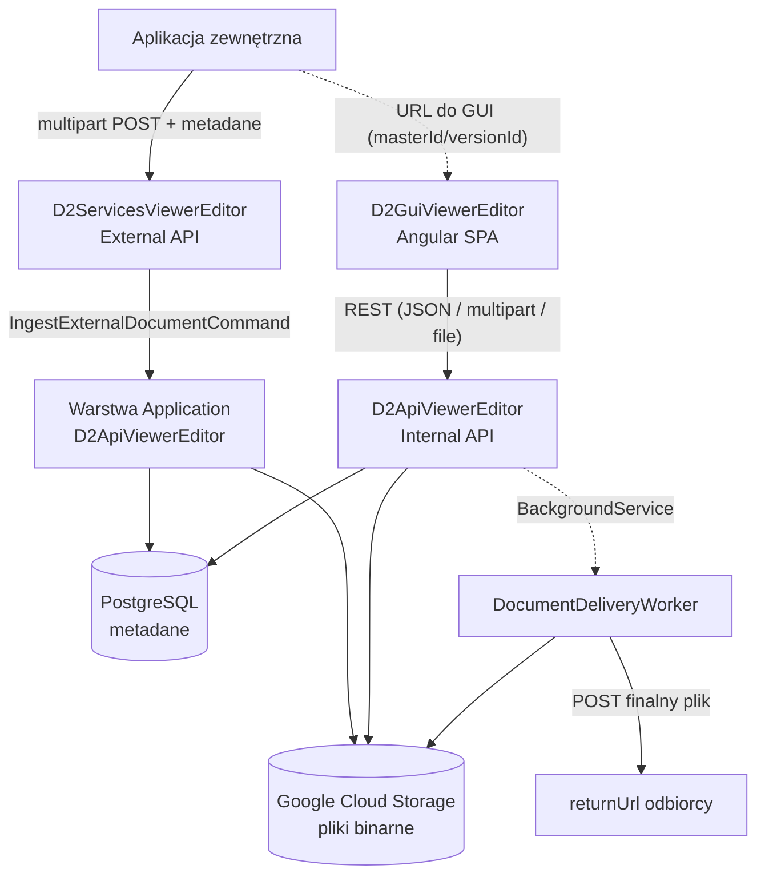
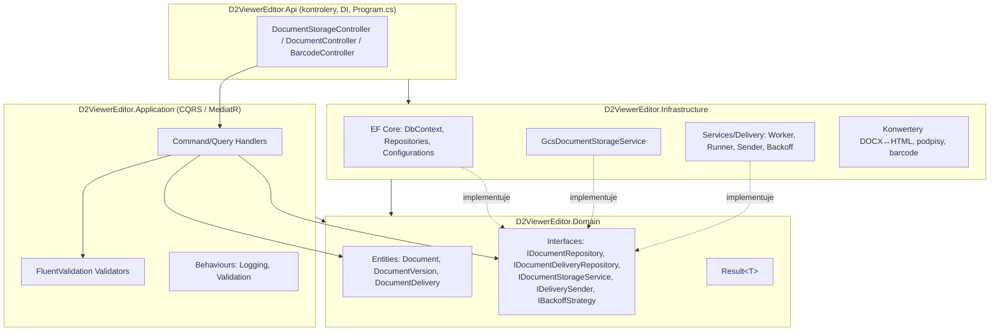
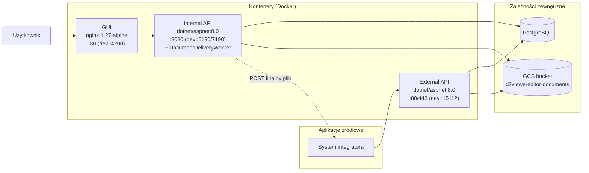
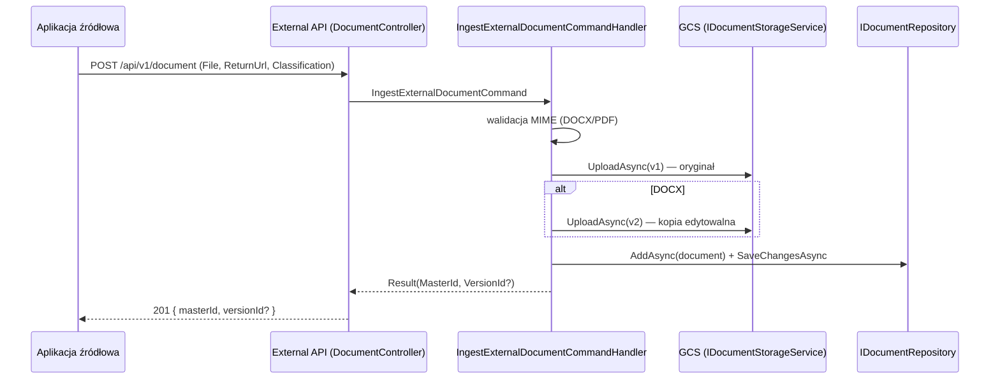
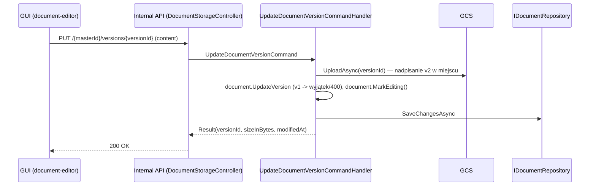
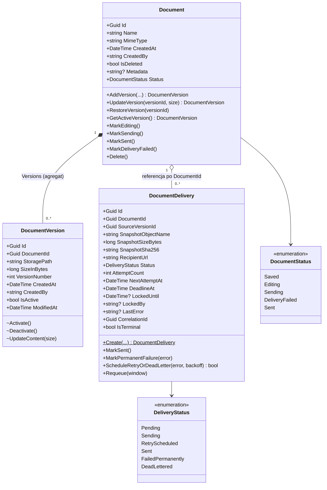
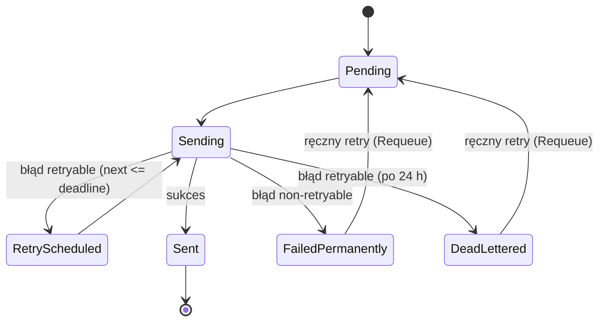
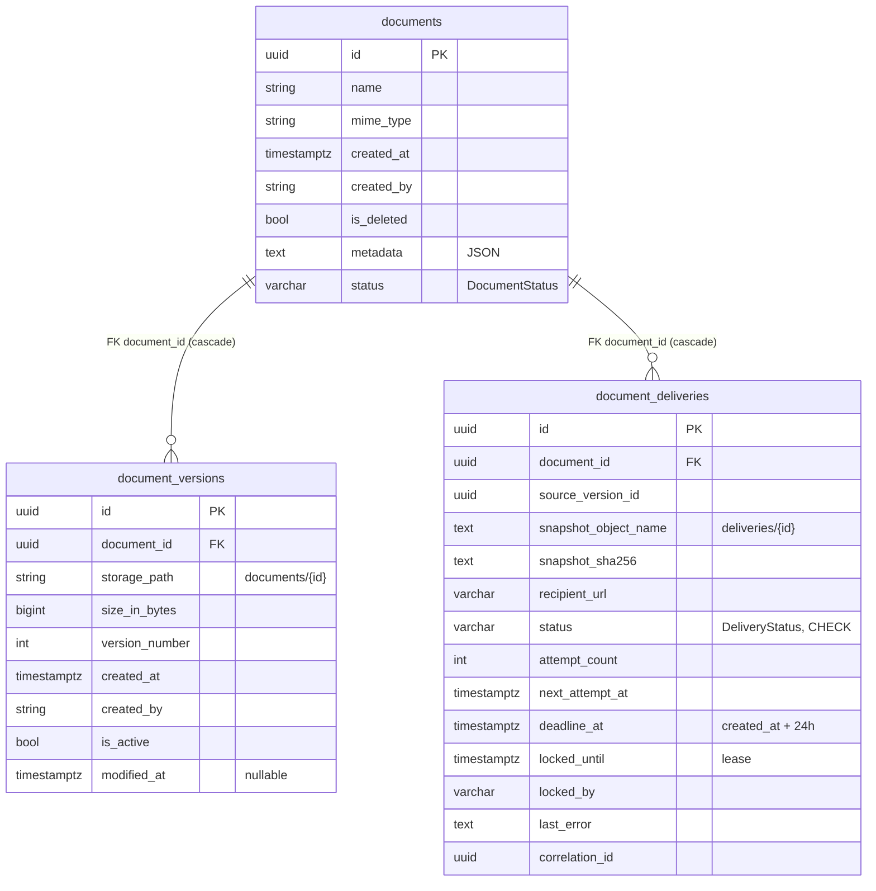
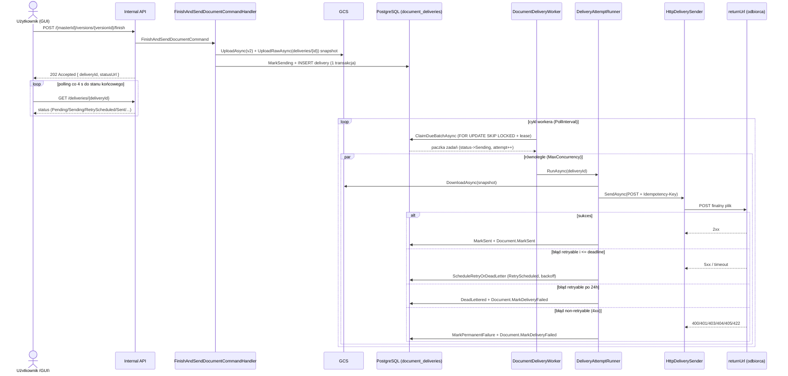

# D2 ViewerEditor — Dokumentacja projektowa

> Dokument zsyntetyzowany z folderu `.ai` (operacyjna pamięć projektu). Opisuje aktualny stan systemu według dokumentacji źródłowej. Źródłem prawdy o szczegółach implementacji pozostaje kod; przy rozbieżności sprawdź repozytorium.
>
> Legenda znaczników: **[Fakt]** — potwierdzone w `.ai`/kodzie · **[Rekomendacja]** — sugestia, nie stan obecny · **[Założenie]** — przyjęte, niepotwierdzone w repo · **[Do weryfikacji]** — wymaga potwierdzenia.

## Spis treści

1. [Cel systemu](#cel-systemu)
2. [Architektura](#architektura)
3. [Przepływy biznesowe](#przeplywy-biznesowe)
4. [Backend (.NET)](#backend-net)
5. [Model domenowy (DDD)](#model-domenowy-ddd)
6. [Baza danych (PostgreSQL)](#baza-danych-postgresql)
7. [Worker wysyłki „Zakończ i wyślij”](#worker-wysylki)
8. [API](#api)
9. [Frontend (Angular)](#frontend-angular)
10. [Integracje i infrastruktura](#integracje-i-infrastruktura)
11. [Bezpieczeństwo](#bezpieczenstwo)
12. [Testy i jakość](#testy-i-jakosc)
13. [Obserwowalność](#obserwowalnosc)
14. [Decyzje architektoniczne (ADR)](#decyzje-architektoniczne-adr)
15. [Konwencje kodowania](#konwencje-kodowania)
16. [Ograniczenia, ryzyka i założenia](#ograniczenia-ryzyka-i-zalozenia)
17. [Nierozstrzygnięte niespójności](#nierozstrzygniete-niespojnosci)
18. [Praca z repozytorium dla agentów AI](#praca-z-repozytorium-dla-agentow-ai)

---

## Cel systemu

**[Fakt]** D2 ViewerEditor to webowy edytor/viewer dokumentów **DOCX i PDF** z wersjonowanym storage, przeznaczony do integracji z aplikacjami zewnętrznymi.

System umożliwia aplikacjom źródłowym oddanie dokumentu do bezpiecznego podglądu i edycji w przeglądarce, z zachowaniem nietkniętego oryginału i kontrolowanym zwrotem zmienionej wersji — bez lokalnego pakietu biurowego.

Kluczowe wartości:

- Oryginał (v1) zawsze nietknięty.
- Auto-save bez mnożenia wersji (nadpisanie wersji edytowalnej v2 w miejscu).
- Tryb pracy (podgląd vs edycja) zależny od parametrów URL.
- Integracja z systemami źródłowymi: ingest + URL zwrotny + klasyfikacja dokumentu.
- Wersjonowanie z możliwością przywracania, podpisy cyfrowe, kody kreskowe/QR.

Główni użytkownicy: użytkownik końcowy (edycja/podgląd w GUI), aplikacja źródłowa (integrator), administrator (`/admin` w GUI), developer/maintainer.

---

## Architektura

**[Fakt]** Repozytorium zawiera trzy projekty:

| Projekt | Rola | Konsument |
|---|---|---|
| `D2ApiViewerEditor` | **Internal API** — obsługuje GUI (CRUD, konwersje, podpisy, wersje, wysyłka) | GUI |
| `D2ServicesViewerEditor` | **External / Services API** — przyjmuje dokumenty od aplikacji źródłowych (ingest) | aplikacje źródłowe |
| `D2GuiViewerEditor` | **GUI** — Angular SPA (PDFViewer / DocxEditor) | użytkownik końcowy |

Aplikacja zewnętrzna rozmawia z External API, następnie otwiera GUI po URL (`?masterId=...[&versionId=...]`). GUI rozmawia wyłącznie z Internal API. External API deleguje logikę do warstwy Application z `D2ApiViewerEditor` (komenda `IngestExternalDocumentCommand`).



### Warstwy backendu (Clean Architecture)

**[Fakt]** Solucja `D2ViewerEditor.sln` dzieli backend na warstwy z jednokierunkowymi zależnościami:

| Warstwa | Odpowiedzialność |
|---|---|
| `D2ViewerEditor.Domain` | encje (`Document`, `DocumentVersion`, `DocumentDelivery`), interfejsy, `Result<T>`, reguły/inwarianty. Zero zależności infrastrukturalnych. |
| `D2ViewerEditor.Application` | przypadki użycia (CQRS handlers w `Features/...`), walidatory, behaviours (Logging, Validation). |
| `D2ViewerEditor.Infrastructure` | EF Core (DbContext, repo, configurations), GCS, konwertery DOCX↔HTML, podpisy, barcode, worker wysyłki (`Services/Delivery`). |
| `D2ViewerEditor.Api` | kontrolery, `Program.cs`, DI, mapowanie na HTTP. |

Kierunki zależności: `Api → Application → Domain`, `Api → Infrastructure`, `Infrastructure → Domain/Application (abstrakcje)`.



> Diagram zależności jest jednokierunkowy: domena nie zna infrastruktury; infrastruktura implementuje abstrakcje zdefiniowane w domenie/aplikacji.

### Widok wdrożenia (kontenery)



> **[Do weryfikacji]** Orkiestracja kontenerów (compose/Cloud Run/GKE) nie jest potwierdzona w repo — diagram pokazuje obrazy i porty z Dockerfile/launchSettings, nie topologię produkcyjną.

Dodatkowe projekty: `D2ViewerEditor.Benchmarks` (BenchmarkDotNet) oraz projekty testowe `*.UnitTests`.

### Przetwarzanie w tle

**[Fakt]** `DocumentDeliveryWorker : BackgroundService` hostowany jest w procesie Internal API i rejestrowany w `Infrastructure/DependencyInjection` (`AddHostedService`). Szczegóły w sekcji [Worker wysyłki](#worker-wysylki).

---

## Przepływy biznesowe

**[Fakt]** Główne scenariusze:

1. **Ingest (Krok 1):** aplikacja zewnętrzna wysyła plik + metadane → External API zapisuje. DOCX → oryginał v1 + edytowalna kopia v2; PDF → tylko v1. Zwraca `{ MasterId, VersionId? }`.
2. **Tryb podglądu (Krok 2):** GUI z `?masterId=` ładuje treść w trybie read-only (PDFViewer dla PDF, DocxEditor dla DOCX). **[Do weryfikacji / In Progress]** — patrz [niespójności](#nierozstrzygniete-niespojnosci) i ryzyko R-02.
3. **Tryb edycji (Krok 3):** GUI z `?masterId=&versionId=` ładuje wersję edytowalną; auto-save nadpisuje v2 w miejscu.
4. **Zakończ i wyślij (Krok 4):** backend utrwala stan edytora, zamraża niezmienny snapshot finalnego pliku i tworzy zadanie wysyłki; worker w tle asynchronicznie wysyła plik na `ReturnUrl` z metadanych (retry do 24 h). GUI odpytuje status.

### Sekwencja: Ingest (Krok 1)



### Sekwencja: Auto-save / „Zapisz” (Krok 3)



---

## Backend (.NET)

### Stack

**[Fakt]** (wartości zweryfikowane w `.csproj` na dzień aktualizacji `.ai`):

| Obszar | Wartość |
|---|---|
| Runtime | .NET 8 (`net8.0`); projekty testowe targetują `net9.0` |
| Architektura | Clean Architecture + CQRS/MediatR |
| Walidacja | FluentValidation (komendy mają walidatory) |
| ORM / baza | EF Core 8 (`8.0.12`) + Npgsql (`8.0.11`) / PostgreSQL |
| Storage | `Google.Cloud.Storage.V1` 4.10.0 (fake-gcs-server w DEV) |
| DOCX | `DocumentFormat.OpenXml` 3.0.2 + `HtmlAgilityPack` 1.11.61 |
| Kody kreskowe | `ZXing.Net` 0.16.9 + `SkiaSharp` 3.116.1 |
| Worker w tle | `BackgroundService` + typed `HttpClient` (`Microsoft.Extensions.Hosting.Abstractions` 8.0.1, `Microsoft.Extensions.Http` 8.0.1) |
| Swagger | `Swashbuckle.AspNetCore` 6.5.0 |
| Testy | NUnit 4.2.2 + FluentAssertions 8.8.0 + Moq 4.20.72 / NSubstitute 5.3.0 |

### Wzorce

- **CQRS/MediatR:** komendy zmieniają stan, query czytają. Struktura: `Features/{Obszar}/{Commands|Queries}/{Nazwa}/` z osobnym `*Command/Query.cs` i `*Handler.cs`.
- **Pipeline behaviours:** `LoggingBehaviour`, `ValidationBehaviour` (auto-rejestracja walidatorów z assembly).
- **`Result<T>`** (`Domain/Common/Result.cs`): `IsSuccess`, `IsFailure`, `IsNotFound`, `Value`, `Error`, `Match(...)`. Handlery zwracają `Result`, nie rzucają wyjątków na ścieżce biznesowej.
- **Repozytoria:** `IDocumentRepository` / `DocumentRepository` (odczyty `AsNoTracking()`, filtr soft-delete), `IDocumentDeliveryRepository` / `DocumentDeliveryRepository`. `SaveChangesAsync` wywoływane osobno (encje śledzone).
- **Granice:** kontrolery bez logiki biznesowej; logika domenowa w domenie; infrastruktura bez decyzji biznesowych; encje EF nie są kontraktem API (osobne DTO).

### Obsługa błędów

- Handlery zwracają `Result.Failure`/`Result.NotFound`; kontrolery mapują na statusy HTTP.
- Istnieje `ExceptionHandlingMiddleware` (Api/Middleware) w pipeline.
- Format błędu API: styl `{ "error": "komunikat" }` (część endpointów używa `ProblemDetails` w `BaseApiController`). **[Do weryfikacji]** — ujednolicenie formatu błędu nie jest w pełni spójne między endpointami.

---

## Model domenowy (DDD)

### Encje

**[Fakt]**

- **`Document`** (aggregate root): `Id` (guid_master), `Name`, `MimeType`, `CreatedAt`, `CreatedBy`, `IsDeleted`, `Metadata` (JSON), `Status` (`DocumentStatus`), `Versions`. Metody: `AddVersion`, `UpdateVersion`, `RestoreVersion`, `GetActiveVersion`, `MarkEditing/MarkSending/MarkSent/MarkDeliveryFailed`, `Delete`.
- **`DocumentVersion`**: `Id` (guid_wersji), `DocumentId`, `StoragePath` (`documents/{versionId}`), `SizeInBytes`, `VersionNumber`, `CreatedAt`, `CreatedBy`, `IsActive`, `ModifiedAt`. Mutacje (`Activate/Deactivate/UpdateContent`) tylko przez agregat `Document`.
- **`DocumentDelivery`** (aggregate root kolejki wysyłki): snapshot finalnego pliku + adres odbiorcy + stan retry. Fabryka `Create(...)` waliduje `recipientUrl` (http(s)) i ustawia `DeadlineAt` (24 h). Metody: `MarkSent`, `MarkPermanentFailure`, `ScheduleRetryOrDeadLetter`, `Requeue`.



> `DocumentVersion` jest częścią agregatu `Document` (mutacje tylko przez agregat). `DocumentDelivery` to osobny aggregate root powiązany przez `DocumentId` (bez nawigacji EF) — w danej chwili aktywne jest maks. jedno (BR-011).

### Statusy

- **`DocumentStatus`:** `Saved` → `Editing` → `Sending` → `Sent` / `DeliveryFailed`.
- **`DeliveryStatus`:** `Pending` / `Sending` / `RetryScheduled` / `Sent` / `FailedPermanently` / `DeadLettered`.



### Reguły biznesowe (BR)

**[Fakt]**

| ID | Reguła |
|---|---|
| BR-001 | Tylko jedna wersja aktywna naraz; `AddVersion` dezaktywuje poprzednie. |
| BR-002 | Wersja oryginalna (v1) jest nietykalna — `UpdateVersion` na v1 rzuca wyjątkiem. |
| BR-003 | Ingest DOCX → master + v1 + v2; zwraca `{ MasterId, VersionId }`. |
| BR-004 | Ingest PDF → master + tylko v1; zwraca `{ MasterId, null }`. |
| BR-005 | Auto-save / „Zapisz” nadpisują v2 w miejscu (ten sam obiekt GCS). |
| BR-006 | Klasyfikacja `C1..C4` obligatoryjna przy ingeście. |
| BR-007 | `ReturnUrl` wymagany dla DOCX, opcjonalny dla PDF. |
| BR-008 | Backend jest źródłem prawdy walidacji; frontend waliduje tylko UX. |
| BR-009 | Podpis cyfrowy = Custom XML Part (RSA-SHA256), nie standardowy OOXML; hash z `MainDocumentPart`. |
| BR-010 | „Zakończ i wyślij” wymaga poprawnego `ReturnUrl` (absolutny http(s)). |
| BR-011 | Tylko jedno aktywne (nieterminalne) zadanie wysyłki na dokument (unique partial index); wielokrotne kliknięcie zwraca istniejące zadanie. |
| BR-012 | Wysyłany jest niezmienny snapshot z chwili „Zakończ” (`deliveries/{deliveryId}`), nie bieżąca v2. |
| BR-013 | Wysyłka at-least-once z retry (exponential backoff + jitter, cap 15 min) do 24 h → `DeadLettered`; błąd non-retryable → `FailedPermanently`. |

---

## Baza danych (PostgreSQL)

**[Fakt]**

- Engine: PostgreSQL; ORM: EF Core 8 + Npgsql.
- **Migracje: ręczny SQL w `infra/sql/` — NIE EF Migrations.** Nowa zmiana = nowy ponumerowany skrypt + mapowanie w odpowiednim `*Configuration`. Kolumny dodawać `ADD COLUMN IF NOT EXISTS` + `COMMENT ON COLUMN`.
- `DocumentDbContext` z `DbSet<Document>`, `DbSet<DocumentVersion>`, `DbSet<DocumentDelivery>`. Konfiguracje: `DocumentConfiguration`, `DocumentVersionConfiguration`, `DocumentDeliveryConfiguration` (enumy `HasConversion<string>()`).
- Pliki binarne NIE w bazie — w GCS (bucket `d2viewereditor-documents`); w bazie tylko `storage_path` / nazwa obiektu.

### Skrypty `infra/sql/`

| Plik | Co robi |
|---|---|
| `001_init_schema.sql` | Schemat początkowy (documents, document_versions) |
| `002_init_indexes.sql` | Indeksy |
| `003_migrate_storage_to_gcs.sql` | Przejście storage na GCS |
| `004_add_document_metadata.sql` | `documents.metadata TEXT` (JSON) |
| `005_add_version_modified_at.sql` | `document_versions.modified_at TIMESTAMPTZ` |
| `006_add_document_status.sql` | `documents.status VARCHAR(40) DEFAULT 'Saved'` |
| `007_add_document_deliveries.sql` | Tabela `document_deliveries` + indeksy + check status |

### Tabele

- **`documents`:** `id` (PK), `name`, `mime_type`, `created_at`, `created_by`, `is_deleted`, `metadata` (text/JSON), `status`. Indeksy: `created_at`, `is_deleted`.
- **`document_versions`:** `id` (PK), `document_id` (FK→documents, cascade), `storage_path` (≤500), `size_in_bytes`, `version_number`, `created_at`, `created_by`, `is_active`, `modified_at`. Indeksy: `document_id`, `(document_id, is_active)`, `created_at`.
- **`document_deliveries`:** `id` (PK), `document_id` (FK→documents, cascade), `source_version_id`, `snapshot_object_name`, `snapshot_size_bytes`, `snapshot_sha256`, `recipient_url`, `status`, `attempt_count`, znaczniki czasu (`created_at`, `updated_at`, `first_attempt_at`, `last_attempt_at`, `next_attempt_at`, `deadline_at`), `locked_until` + `locked_by` (lease techniczny — nie status), `last_error`, `correlation_id`, `created_by`. Indeksy: partial `ix_..._due`, partial `ix_..._stuck`, **unique partial** `ux_..._active_per_document` (idempotencja), `ix_..._status`; `CHECK` na dozwolone statusy.



> `ux_..._active_per_document` to **unique partial index** na `document_id WHERE status IN ('Pending','Sending','RetryScheduled')` — egzekwuje BR-011 (jedno aktywne zadanie na dokument). Składni partial index nie da się wyrazić w ERD — opis pozostaje w tekście.

---

## Worker wysyłki

**[Fakt]** Funkcja „Zakończ i wyślij” realizuje asynchroniczną, trwałą wysyłkę finalnego dokumentu na `ReturnUrl`.

Przepływ:

1. `POST /api/documentstorage/{masterId}/versions/{versionId}/finish` → `FinishAndSendDocumentCommand`:
   - nadpisuje wersję edytowalną treścią z edytora,
   - zamraża niezmienny snapshot w GCS (`deliveries/{deliveryId}`, SHA-256),
   - atomowo (jeden `SaveChanges`) ustawia `Document.Status = Sending` i tworzy `DocumentDelivery`.
2. `DocumentDeliveryWorker` (BackgroundService) cyklicznie claimuje paczki zadań z `document_deliveries` przez `SELECT ... FOR UPDATE SKIP LOCKED` + lease (`locked_until`), przetwarza je równolegle z limitem (`Parallel.ForEachAsync`, `MaxConcurrency`), każde w osobnym DI scope (`DeliveryAttemptRunner`).
3. Wysyłka: typed `HttpClient` (`HttpDeliverySender`) — POST z nagłówkami `Idempotency-Key = deliveryId` i `X-Content-SHA256`. Retry: `ExponentialJitterBackoff` (cap 15 min), twardy limit 24 h → `DeadLettered`. Błąd non-retryable (np. 400/401/403/404/405/422) → `FailedPermanently`.
4. Po sukcesie `Document.Status = Sent`; po porażce terminalnej `DeliveryFailed`.

### Sekwencja: „Zakończ i wyślij” + przetwarzanie przez workera



Odporność:

- **Wiele instancji:** `FOR UPDATE SKIP LOCKED` gwarantuje brak duplikatów.
- **Restart:** zawieszone zadania `Sending` z wygasłym lease są przejmowane ponownie.
- **Brak utraty zadań:** stan trwały w PostgreSQL.
- **Idempotencja kliknięcia:** unique partial index (jedno aktywne zadanie/dokument).
- **Niezmienność wysyłki:** snapshot zamrożony przy „Zakończ”.

Konfiguracja (`appsettings.json` → `DeliveryWorker`):

```json
"DeliveryWorker": {
  "Enabled": true,
  "PollInterval": "00:00:15",
  "BatchSize": 20,
  "MaxConcurrency": 4,
  "Lease": "00:05:00",
  "RetentionWindow": "1.00:00:00",
  "HttpTimeout": "00:00:30"
}
```

`Enabled=false` pozwala wyłączyć przetwarzanie kolejki na danej instancji (np. wydzielić wysyłkę na dedykowaną instancję bez osobnego projektu/hosta).

---

## API

**[Fakt]** REST over HTTP/JSON (+ multipart dla plików). Dwa backendy:

- **Internal API** (`D2ApiViewerEditor`) — bez wersji w ścieżce (`/api/...`); konsument: GUI.
- **External API** (`D2ServicesViewerEditor`) — wersjonowanie w URL (`/api/v1/...`); konsument: aplikacje źródłowe.

Zasada kompatybilności: nie zmieniać kontraktu w sposób breaking bez świadomej decyzji.

### Internal API — wybrane endpointy (`/api/documentstorage`)

| Metoda | Ścieżka | Opis |
|---|---|---|
| GET | `/?skip=&take=` | Lista dokumentów (admin) |
| POST | `/upload` | Upload nowego dokumentu |
| POST | `/{masterId}/save` | Nowa wersja (`AddVersion`) |
| PUT | `/{masterId}/versions/{versionId}` | Nadpisanie wersji w miejscu (auto-save); v1 → 400 |
| GET | `/{masterId}` | Dokument + aktywna wersja |
| GET | `/{masterId}/metadata` | Metadane (returnUrl, classification) |
| GET | `/{masterId}/versions` | Historia wersji |
| GET | `/{masterId}/download` | Bajty wersji bazowej (v1) |
| GET | `/{masterId}/versions/{versionId}/download` | Bajty konkretnej wersji |
| POST | `/{masterId}/restore/{versionId}` | Przywróć wersję |
| POST | `/{masterId}/versions/{versionId}/finish` | „Zakończ i wyślij” → **202 Accepted** `{ deliveryId, status, statusUrl }` |
| GET | `/deliveries/{deliveryId}` | Status zadania wysyłki |
| GET | `/deliveries?status=&skip=&take=` | Lista zadań w statusie (monitoring/admin; GUI `/admin/deliveries`). DTO zawiera też `lockedUntil`/`lockedBy` |
| POST | `/deliveries/{deliveryId}/retry` | Ręczne ponowienie nieudanego zadania |

Pozostałe kontrolery Internal API: `DocumentController` (`/api/document` — operacje bezstanowe: open/save/sign/verify-signatures/templates; `export-pdf` = **501 placeholder**), `BarcodeController` (`/api/barcode`), `HealthController` (`/api/health`).

### External API (`/api/v1/document`)

| Metoda | Ścieżka | Opis |
|---|---|---|
| POST | `/api/v1/document` | Ingest DOCX/PDF (multipart): `File`, `ReturnUrl`, `Classification` (C1..C4), opc. `X-Created-By` → 201 `{ masterId, versionId? }` |
| GET | `/api/v1/document/{documentId}` | Placeholder (read flow niezaimplementowany) |

Metadane trafiają do `documents.metadata` jako `{ "returnUrl": "...", "classification": "C2" }`.

---

## Frontend (Angular)

**[Fakt]**

- Angular 20 (standalone components + Signals), TypeScript ~5.8, RxJS ~7.8 (do HTTP), `pdfjs-dist` ^5.5 (PDF). Testy: Vitest ^3.1. **`npm run lint` nie istnieje** w `package.json`.
- Struktura `src/app`: `components/` (m.in. `document-editor` — główny, ~3.3k linii, `wysiwyg-editor`, `editor-toolbar`, `barcode-dialog`, `ruler`), `pages/` (dashboard, document-editor wrapper, pdf-viewer lazy, `admin/` lazy: `admin-shell` + `admin-files` + `admin-deliveries`), `services/` (`document.service`, `document-storage.service`, `barcode.service`, `admin.service`), `core/` (api-config, interceptory `http-error`, global error handler), `models/`.
- Wzorzec: komponenty trzymają stan w Signals; HTTP wyłącznie przez serwisy; `api-config.service` centralizuje `apiUrl`.

Wybrane funkcje GUI:

- **Auto-save:** timer (`environment.autoSave { enabled, intervalSeconds: 30 }`), switch „AutoSave”, sygnały `autoSaveEnabled/autoSaveStatus/lastAutoSaveAt`. „Zapisz” = zapis przez API; „Pobierz dokument” = pobranie lokalne.
- **Zakończ i wyślij:** `finishDocument()` serializuje DOCX, woła `finishAndSend`, ustawia sygnały `isFinishing/deliveryStatus/deliveryId` i odpytuje `getDeliveryStatus` co 4 s (`timer` + `takeWhile`) do stanu końcowego. Wysyłka jest kontynuowana po stronie serwera po zamknięciu strony.

Konwencje (z `FRONTEND_ANGULAR.md`): silne typowanie, unikać `any`/`!`, typy związkowe dla stanów, komunikacja HTTP w serwisach, obsługa loading/error/empty, nie migrować stylu Angulara przy okazji zwykłych zadań.

---

## Integracje i infrastruktura

### Google Cloud Storage

**[Fakt]** Pliki binarne w GCS (bucket `d2viewereditor-documents`); w DEV fake-gcs-server (custom endpoint, bez autoryzacji). Abstrakcja `IDocumentStorageService` / `GcsDocumentStorageService` (`UploadAsync`, `UploadRawAsync`, `DownloadAsync`, `ExistsAsync`, `DeleteAsync`). Nazwa obiektu wersji: `documents/{versionId}`; snapshot wysyłki: `deliveries/{deliveryId}`.

### Docker i porty

| Obraz / usługa | Plik / źródło | Port |
|---|---|---|
| Internal API | `docker/api.dockerfile` (`dotnet/aspnet:8.0`) | 8080 (DEV: 5190 / 7190) |
| GUI | `docker/gui.dockerfile` (build `node:22-alpine` → `nginx:1.27-alpine`) | 80 (ng serve: 4200) |
| External API | `D2ServicesViewerEditor/Dockerfile` (`dotnet/aspnet:8.0`) | 80/443 (DEV: 15112 z `Urls`) |

Swagger: Internal `/swagger` (5190), External `/swagger` (15112). Włączany flagą `Swagger:Enabled`.

### Konfiguracja vs sekrety

- Jawna konfiguracja: `appsettings.json`, `appsettings.{ENV}.json`.
- Sekrety: `appsettings.{ENV}.secrets.json` — **poza repo** (nie commitować, nie logować, nie kopiować do dokumentacji).
- Frontend `environment.*` (w tym `apiUrl`) NIE jest sekretem — trafia do bundla.

### Lokalny start

```bash
# Wymagane poza repo: PostgreSQL (skrypty infra/sql/ 001..007 w kolejności)
#                     + GCS / fake-gcs-server (bucket d2viewereditor-documents)

cd D2ApiViewerEditor && dotnet run --project D2ViewerEditor.Api          # Internal API
cd D2ServicesViewerEditor && dotnet run --project D2ServicesViewerEditor.Api  # External API
cd D2GuiViewerEditor && npm install && npm start                         # GUI :4200
```

### CI/CD i pozostała infrastruktura GCP

**[Do weryfikacji]** Brak w repo: `docker-compose*.yml`, pipeline CI/CD (`.github/workflows`, `.gitlab-ci.yml`), IaC. Pozostała infrastruktura GCP (Cloud Run/GKE, Cloud SQL, Secret Manager, IAM) niepotwierdzona w repo.

---

## Bezpieczeństwo

**[Fakt]**

- Sekrety wyłącznie w `appsettings.{ENV}.secrets.json` (poza repo); connection stringi i klucze GCS to sekrety — nie logować.
- Walidacja FluentValidation. Ingest: niepusty plik, MIME ∈ {DOCX, PDF}, rozmiar ≤ 100 MB, metadata = poprawny JSON, classification ∈ {C1..C4}, ReturnUrl wymagany dla DOCX. Limity uploadu w kontrolerze (`RequestSizeLimit` ~110 MB).
- Handlery zwracają `NotFound` zamiast ufać `masterId`/`versionId` z requestu.
- Treść WYSIWYG pochodzi od użytkownika — uważać na XSS (bezpieczne mechanizmy Angulara, nie ręczny `innerHTML`).
- Podpisy cyfrowe: certyfikaty/hasła do `/api/document/sign` są wrażliwe — nie logować, nie zapisywać.
- Wysyłka: `RecipientUrl` walidowany jako absolutny http(s); POST z `Idempotency-Key`; wysyłany niezmienny snapshot.

**[Do weryfikacji]** Mechanizm auth/autoryzacji nie został potwierdzony w `.ai` — sprawdzić `Program.cs`/middleware obu API przed zmianami auth.

**[Rekomendacja]** `RecipientUrl` pochodzi z danych zewnętrznych i jest celem żądań serwerowych workera — rozważyć ochronę przed SSRF (allowlista hostów/schematów, blokada adresów prywatnych i endpointu metadata `169.254.169.254`). Obecnie walidowany jest tylko format http(s).

---

## Testy i jakość

**[Fakt]**

- Backend: NUnit 4 + FluentAssertions + Moq / NSubstitute. Projekty `D2ViewerEditor.{Api,Application,Domain,Infrastructure}.UnitTests`. Benchmarki: `D2ViewerEditor.Benchmarks`.
- Frontend: Vitest (`npm test`); `ng build` jest podstawową bramką kompilacji (brak `npm run lint`).
- Co testować: reguły domenowe (wersje, v1 immutable, statusy delivery), walidatory, handlery, mapowanie DTO, statusy HTTP, konwersje DOCX↔HTML, podpisy, logika `document-editor` (auto-save, finish).

Komendy weryfikacji:

```bash
dotnet build D2ApiViewerEditor/D2ViewerEditor.sln
dotnet test  D2ApiViewerEditor/D2ViewerEditor.sln
cd D2GuiViewerEditor && npm run build && npm test
```

**[Do weryfikacji]** Brak testów integracyjnych claimu wysyłki (`FOR UPDATE SKIP LOCKED` / reclaim) na realnym PostgreSQL — pokrycie obecnie jednostkowe (ryzyko R-06).

---

## Obserwowalność

**[Fakt]**

- Structured logging przez `ILogger` (pipeline `LoggingBehaviour`). Worker loguje w scope `deliveryId` + `correlationId` + `attempt` (utworzenie zadania, claim, wynik próby, błędy).
- Tabela `document_deliveries` przechowuje ślad audytowy: `attempt_count`, `last_error`, `last_attempt_at`, `correlation_id`, `created_by`. Monitoring liczności: `SELECT status, count(*) FROM document_deliveries GROUP BY status`. **[Fakt]** Panel admina `/admin/deliveries` w GUI prezentuje listę zadań per status (filtr, `locked_by`, ostatni błąd) z akcją „Ponów" (`POST /deliveries/{id}/retry`).
- Zakaz logowania: hasła, tokeny, certyfikaty, dane osobowe, connection stringi, surowe payloady wrażliwe. Brak `Console.WriteLine` w kodzie aplikacyjnym.

**[Do weryfikacji]** Brak potwierdzenia w `.ai` dedykowanego systemu metryk/alertów (Prometheus/OTel/Grafana). Metryki i alerty pojawiają się w `.ai` jako rekomendacje, nie jako wdrożony stan.

---

## Decyzje architektoniczne (ADR)

**[Fakt]** Rejestr w `.ai/DECISIONS.md`:

| ADR | Decyzja | Status |
|---|---|---|
| 0001 | `.ai/` jako pamięć projektu dla agentów AI | Accepted |
| 0002 | Metadane aplikacji zewnętrznej jako JSON w jednej kolumnie `documents.metadata` | Accepted |
| 0003 | Płaski model zapisu wersji edytowalnej (nadpisanie v2 w miejscu) | Accepted |
| 0004 | „Zapisz” = zapis API, „Pobierz dokument” = pobranie lokalne | Accepted |
| 0005 | „Zakończ i wyślij” jako kolejka w PostgreSQL + worker (bez brokera); snapshot GCS; backoff+jitter; 24 h → DeadLettered; bez Transactional Outbox | Accepted |

---

## Konwencje kodowania

**[Fakt]** (z `BACKEND_DOTNET.md`, `FRONTEND_ANGULAR.md`, `CODING_STANDARDS.md`)

Backend:

- nullable reference types, `async/await` dla I/O, sufiks `Async`, propagacja `CancellationToken`.
- Reguły biznesowe blisko domeny; brak zależności infrastrukturalnych w domenie; encje EF nie jako kontrakt API.
- `AsNoTracking()` dla odczytów; unikać N+1; jawne projekcje do DTO.
- Statusy HTTP wg standardu (200/201/204/400/401/403/404/409/422).
- **Nie generować migracji EF** — schemat to ręczny SQL.

Frontend:

- Silne typowanie, unikać `any`/non-null `!`, typy związkowe dla stanów.
- Logika HTTP w serwisach; centralna konfiguracja URL; obsługa loading/error/empty.
- Nie dodawać bibliotek UI bez decyzji; nie migrować stylu Angulara przypadkowo.

Ogólne: małe, odwracalne, łatwe do review zmiany; brak przypadkowych refaktorów; brak twardych sekretów; komentarze wyjaśniają „dlaczego”, nie „co”.

---

## Ograniczenia, ryzyka i założenia

**[Fakt]** (z `RISKS_ASSUMPTIONS.md`, `CURRENT_STATE.md`)

Założenia:

| ID | Założenie | Status |
|---|---|---|
| A-02 | Lokalny PostgreSQL i GCS uruchamiane poza repo (brak docker-compose) | Open |
| A-03 | Schemat bootstrapowany skryptami `infra/sql/` (001..007) w kolejności | Open |
| A-04 | Wersja edytowalna (v2) to dosłowna kopia bajtów oryginału, nie konwersja | Open |
| A-05 | Mechanizm auth — niepotwierdzony | Open |
| A-06 | Odbiorca `returnUrl` akceptuje POST z plikiem i obsługuje `Idempotency-Key` | Open |

Ryzyka:

| ID | Ryzyko | Status |
|---|---|---|
| R-01 | Brak CI/CD i docker-compose → niespójny build/deploy | Open |
| R-02 | Tryb podglądu (Krok 2) ładuje aktywną wersję (v2), nie v1 | Open |
| R-06 | Brak testów integracyjnych claimu wysyłki na realnym PostgreSQL | Open |
| R-07 | `RecipientUrl` z danych zewnętrznych → ryzyko SSRF | Open |
| R-08 | Auto-save może nadpisać v2 po utworzeniu zadania — wysyłany jednak niezmienny snapshot (świadome) | Open |

Poza zakresem bez jawnej decyzji: redesign UI, zmiana frameworka/architektury, migracja bazy/auth, breaking changes w API, aktualizacja major .NET/Angular, eksport PDF (celowy `501`).

---

## Nierozstrzygnięte niespójności

> Sekcja wymagana regułami: sprzeczności pomiędzy plikami `.ai`.

1. **Status funkcji „Zakończ i wyślij” — ROZSTRZYGNIĘTE.** Wcześniej `PRODUCT_GOALS.md` wykazywał funkcję jako *Planned*, podczas gdy reszta dokumentacji (`FEATURES.md`, `DOMAIN.md`, `API_CONTRACTS.md`, `DATABASE.md`, `CURRENT_STATE.md`, `DECISIONS.md` ADR-0005) opisuje ją jako **wdrożoną**. `PRODUCT_GOALS.md` został zaktualizowany — cała dokumentacja `.ai` jest obecnie spójna (status: Implemented).

2. **Tryb podglądu (Krok 2).** Dokumentacja jest spójna co do tego, że endpointy istnieją, ale GUI ładuje aktywną wersję (po DOCX = v2) zamiast oryginału v1 (`FEATURES.md`, `RISKS_ASSUMPTIONS.md` R-02). To znany, otwarty problem, nie sprzeczność — odnotowane dla jasności.

3. **Format błędu API.** `API_CONTRACTS.md` wskazuje styl `{ "error": "..." }`, a `BaseApiController` używa `ProblemDetails` dla części odpowiedzi. **[Do weryfikacji]** — faktyczny, spójny format błędu między wszystkimi endpointami.

---

## Praca z repozytorium dla agentów AI

**[Fakt]** Folder `.ai/` to operacyjna pamięć projektu. Kolejność wejścia:

1. `INDEX.md`
2. `PROJECT_CONTEXT.md`
3. `CURRENT_STATE.md`
4. `TASK_HANDOFF.md`
5. pliki specyficzne dla zadania (`BACKEND_DOTNET.md`, `FRONTEND_ANGULAR.md`, `API_CONTRACTS.md`, `DATABASE.md`, `DEVOPS_DEPLOYMENT.md`).

Punkty wejścia narzędzi w katalogu głównym: `CLAUDE.md` (Claude / Claude Code), `AGENTS.md` (inne agenty).

Po istotnej zmianie aktualizować minimum: `CURRENT_STATE.md`, `TASK_HANDOFF.md`, `CHANGELOG.md`; przy decyzji technicznej `DECISIONS.md`; przy ryzyku/założeniu `RISKS_ASSUMPTIONS.md`.

Zasady: weryfikować fakty w repozytorium (nie zgadywać wersji/portów), małe i odwracalne zmiany, nie generować migracji EF, nie zmieniać kontraktów API ani portów bez ustaleń, nie naruszać reguły v1-immutable / płaskiego zapisu, nie commitować sekretów.

---

> **Uwaga końcowa:** dokument jest syntezą stanu opisanego w `.ai`. Sekcje oznaczone **[Do weryfikacji]** / **[Założenie]** / **[Rekomendacja]** nie są potwierdzonym stanem produkcyjnym i wymagają potwierdzenia z zespołem lub w kodzie.
