# Dokumentacja techniczna systemu — D2 ViewerEditor

> Dokument przeznaczony do Confluence. Źródło prawdy: katalog `.ai/` oraz kod repozytorium (stan na 2026-05-26). Sekcje niepotwierdzone w `.ai`/kodzie są jawnie oznaczone **[Wymaga potwierdzenia]** lub **[Brak w repo]**. Rekomendacje są oddzielone od stanu obecnego.
>
> **ERRATA (2026-07-05):** snapshot jest w kilku punktach nieaktualny względem kodu: (1) **auth istnieje** — Internal API wymaga tokenu Entra ID + roli `Operator`/`Administrator` (ADR-0011/0012/0022), `CorporateKey`/`allowedCorporateKeys` są zaimplementowane i egzekwowane (BR-014); (2) tryb podglądu **ładuje v1** (R-02 zamknięte); (3) POST zwrotny na `ReturnUrl` to potwierdzone **`multipart/form-data`** (`file`/`masterId`/`versionId`/`corporateKey`); (4) „Zakończ" wykonuje synchroniczną 1. próbę (200, nie 202) z kontynuacją w tle; (5) SSRF częściowo zmitygowane `ReturnUrlValidator` (ADR-0024). Aktualny stan: `SECURITY.md`, `API_CONTRACTS.md`, `FEATURES.md`. Oznaczenia „[Wymaga potwierdzenia] brak auth" w treści poniżej są historyczne.

## Spis treści

1. [Cel dokumentu](#1-cel-dokumentu)
2. [Executive technical summary](#2-executive-technical-summary)
3. [Mapa dokumentacji](#3-mapa-dokumentacji)
4. [Kontekst biznesowy i techniczny](#4-kontekst-biznesowy-i-techniczny)
5. [Architektura wysokiego poziomu](#5-architektura-wysokiego-poziomu)
6. [Stack technologiczny](#6-stack-technologiczny)
7. [Struktura repozytorium i modułów](#7-struktura-repozytorium-i-modułów)
8. [Backend](#8-backend)
9. [Frontend Angular](#9-frontend-angular)
10. [Model dokumentu i metadanych](#10-model-dokumentu-i-metadanych)
11. [Cykl życia dokumentu](#11-cykl-życia-dokumentu)
12. [Cykl życia aplikacji](#12-cykl-życia-aplikacji)
13. [Przepływy krytyczne](#13-przepływy-krytyczne)
14. [Integracja z systemem](#14-integracja-z-systemem)
15. [API](#15-api)
16. [Bezpieczeństwo](#16-bezpieczeństwo)
17. [Google Cloud Storage](#17-google-cloud-storage)
18. [PostgreSQL](#18-postgresql)
19. [Background jobs / workery](#19-background-jobs--workery)
20. [Deployment i środowiska](#20-deployment-i-środowiska)
21. [CI/CD](#21-cicd)
22. [Observability](#22-observability)
23. [Runbook operacyjny](#23-runbook-operacyjny)
24. [Troubleshooting dla integratorów](#24-troubleshooting-dla-integratorów)
25. [Konwencje projektowe](#25-konwencje-projektowe)
26. [Testowanie](#26-testowanie)
27. [Decyzje architektoniczne](#27-decyzje-architektoniczne)
28. [Ograniczenia, ryzyka i dług techniczny](#28-ograniczenia-ryzyka-i-dług-techniczny)
29. [Rekomendacje Principal DevOps](#29-rekomendacje-principal-devops)
30. [Słownik pojęć](#30-słownik-pojęć)
31. [Źródła](#31-źródła)
32. [Nierozstrzygnięte niespójności i braki](#32-nierozstrzygnięte-niespójności-i-braki)

---

## 1. Cel dokumentu

**Dla kogo:** developerzy, DevOps, architekci, integratorzy (zespoły aplikacji źródłowych) oraz osoby wdrażające się do projektu D2 ViewerEditor.

**Jaki problem rozwiązuje:** dostarcza jedno, uporządkowane źródło wiedzy operacyjno-technicznej o systemie: od celu, przez architekturę i przepływy, po deployment, monitoring i troubleshooting.

**Jak korzystać:** czytaj sekcjami wg [mapy dokumentacji](#3-mapa-dokumentacji). Integratorzy → sekcje [14](#14-integracja-z-systemem) i [15](#15-api). Operacje → sekcje [20](#20-deployment-i-środowiska)–[23](#23-runbook-operacyjny).

**Co obejmuje:** architektura, backend, frontend, model dokumentu, cykle życia, integracja, API, bezpieczeństwo, GCS, PostgreSQL, worker wysyłki, deployment, observability, runbooki.

**Czego nie obejmuje:** kompletnej konfiguracji infrastruktury GCP (poza repo), pipeline'u CI/CD (nie istnieje w repo), mechanizmu uwierzytelniania (niepotwierdzony — patrz [16](#16-bezpieczeństwo)).

> **Ważne:** dokument opisuje **stan obecny**, nie docelowy. Rekomendacje są w sekcji [29](#29-rekomendacje-principal-devops).

---

## 2. Executive technical summary

**Czym jest system:** webowy edytor/viewer dokumentów **DOCX** (edytor WYSIWYG) i **PDF** (podgląd), z wersjonowanym storage, przeznaczony do integracji z aplikacjami zewnętrznymi. Aplikacja źródłowa wysyła dokument + metadane, użytkownik pracuje na nim w przeglądarce, a finalny plik jest asynchronicznie odsyłany na adres zwrotny.

**Główne funkcje:** ingest dokumentu, podgląd PDF, edycja DOCX z auto-save (nadpisanie w miejscu), wersjonowanie z nietykalnym oryginałem, podpisy cyfrowe (Custom XML Part), kody kreskowe/QR, szablony, „Zakończ i wyślij" (asynchroniczna wysyłka na `ReturnUrl`), panel administracyjny (lista plików, monitoring wysyłek), prezentacja klasyfikacji dokumentu.

**Główny stack:** .NET 8 / ASP.NET Core (Clean Architecture + CQRS/MediatR), Angular 20 (standalone + Signals), PostgreSQL (EF Core 8 + Npgsql, schemat = ręczny SQL), Google Cloud Storage (fake-gcs-server w DEV), Docker.

**Najważniejsze komponenty:** trzy hosty — Internal API (`D2ApiViewerEditor`), External API (`D2ServicesViewerEditor`), Angular SPA (`D2GuiViewerEditor`) — plus worker wysyłki w tle `DocumentDeliveryWorker`.

**Najważniejsze przepływy:** ingest → podgląd/edycja → zapis → „Zakończ i wyślij" → asynchroniczna wysyłka z retry do 24 h.

**Najważniejsze ryzyka/ograniczenia:** brak potwierdzonego mechanizmu auth, brak CI/CD i `docker-compose` w repo, brak IaC GCP, możliwy SSRF na `ReturnUrl` (tylko walidacja formatu), tryb podglądu (Krok 2) ładuje aktywną wersję zamiast oryginału. Szczegóły: [28](#28-ograniczenia-ryzyka-i-dług-techniczny).

---

## 3. Mapa dokumentacji

| Sekcja | Dla kogo | Co opisuje | Kiedy czytać |
|---|---|---|---|
| 4–5 Kontekst, Architektura | wszyscy | po co system istnieje, jak zbudowany | onboarding |
| 6–7 Stack, Struktura | dev | technologie, układ repo | start pracy z kodem |
| 8–9 Backend, Frontend | dev | warstwy, komponenty | implementacja |
| 10–11 Model, Cykl życia dokumentu | dev, integrator | dane i lifecycle dokumentu | praca z dokumentem |
| 12 Cykl życia aplikacji | dev, DevOps | start/shutdown/recovery | diagnostyka |
| 13 Przepływy krytyczne | dev, integrator | sekwencje procesów | debugowanie |
| 14–15 Integracja, API | integrator | jak się podłączyć | integracja |
| 16 Bezpieczeństwo | dev, DevOps, security | walidacja, sekrety, dostęp | review bezpieczeństwa |
| 17–19 GCS, PostgreSQL, Workery | dev, DevOps | dane i przetwarzanie w tle | operacje |
| 20–22 Deployment, CI/CD, Observability | DevOps | wdrożenie i monitoring | release/operacje |
| 23–24 Runbook, Troubleshooting | DevOps, support, integrator | reakcja na incydenty | incydent |
| 25–27 Konwencje, Testy, Decyzje | dev | jak pracować, ADR | codzienna praca |
| 28–29 Ryzyka, Rekomendacje | architekt, lead | dług i kierunki | planowanie |
| 30–32 Słownik, Źródła, Niespójności | wszyscy | referencje | wg potrzeby |

---

## 4. Kontekst biznesowy i techniczny

**Po co istnieje aplikacja:** umożliwia aplikacjom zewnętrznym oddanie dokumentu (DOCX/PDF) do bezpiecznego podglądu/edycji w przeglądarce, z zachowaniem oryginału i kontrolowanym zwrotem zmienionej wersji — bez lokalnego pakietu biurowego.

**Kto używa:**
- **użytkownik końcowy** — edytuje/ogląda dokument w GUI,
- **aplikacja źródłowa (integrator)** — wysyła dokumenty przez External API i otwiera GUI po URL,
- **administrator** — zarządza dokumentami i monitoruje wysyłki w `/admin`,
- **developer/maintainer**.

**Jakie dokumenty:** DOCX (edycja) i PDF (podgląd). Dla DOCX tworzona jest edytowalna kopia (v2); oryginał (v1) jest nietykalny.

**Model pracy z dokumentem (4 kroki):**
1. **Ingest** — aplikacja zewnętrzna wysyła plik + metadane (`ReturnUrl`, `Classification`) → zwracane `{ MasterId, VersionId? }`.
2. **Podgląd** — GUI z `?masterId=` ładuje treść read-only.
3. **Edycja** — GUI z `?masterId=&versionId=` ładuje wersję edytowalną; auto-save nadpisuje v2.
4. **Zakończ i wyślij** — backend zamraża snapshot i tworzy zadanie wysyłki; worker odsyła plik na `ReturnUrl`.

---

## 5. Architektura wysokiego poziomu

System składa się z trzech wdrażalnych jednostek + bazy + storage. Aplikacja zewnętrzna rozmawia wyłącznie z External API; GUI rozmawia wyłącznie z Internal API.

### 5.1 Diagram kontekstu systemu

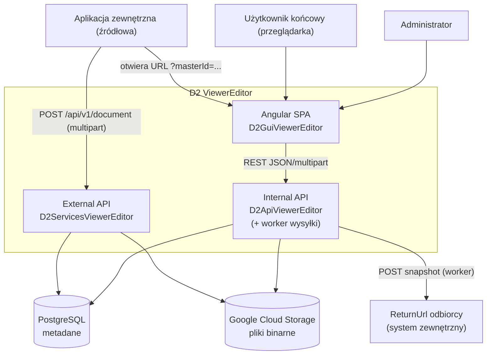

**Objaśnienie:** External API to powierzchnia integracji (ingest). Internal API obsługuje GUI i hostuje worker wysyłki. Dane są rozdzielone: metadane w PostgreSQL, binaria w GCS.

**Wnioski:** aplikacja zewnętrzna nie ma dostępu do Internal API; sama komponuje URL do GUI z `MasterId`/`VersionId`. Worker wysyła pliki na zewnętrzny `ReturnUrl` — to jedyny ruch wychodzący do systemów trzecich.

### 5.2 Diagram komponentów / kontenerów

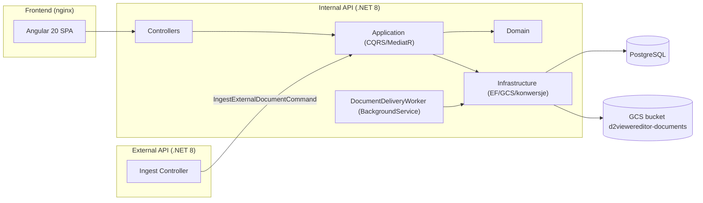

**Objaśnienie:** External API to cienki host, który deleguje do warstwy Application z `D2ApiViewerEditor` (współdzielona logika ingestu). Kierunek zależności: `Api → Application → Domain`, `Api/Infrastructure → Domain`.

**Wnioski:** logika domenowa jest współdzielona; oba API używają tej samej warstwy Application. Worker działa w procesie Internal API (możliwe wydzielenie flagą — patrz [19](#19-background-jobs--workery)).

### 5.3 Odpowiedzialności głównych części

| Element | Odpowiada za | Nie odpowiada za |
|---|---|---|
| Angular component | prezentacja, lokalny stan (Signals) | HTTP bezpośrednio, logika domenowa |
| Angular service | komunikacja z API | renderowanie |
| API controller | HTTP, mapping, statusy | reguły biznesowe |
| Application handler | use-case, orkiestracja | szczegóły UI/HTTP |
| Domain | reguły wersji, inwarianty | dostęp do DB/GCS/HTTP |
| Infrastructure | EF/GCS/konwersje/worker | decyzje biznesowe |

---

## 6. Stack technologiczny

| Obszar | Technologia | Rola w systemie | Uwagi operacyjne |
|---|---|---|---|
| Runtime backend | .NET 8 (`net8.0`) | API + worker | obrazy `dotnet/aspnet:8.0` |
| Architektura | Clean Architecture + CQRS/MediatR | struktura backendu | behaviours: Logging, Validation |
| Walidacja | FluentValidation | walidacja komend | każda komenda ma walidator |
| ORM | EF Core 8 (8.0.12) | dostęp do DB | **bez EF Migrations** |
| Baza | PostgreSQL (Npgsql 8.0.11) | metadane, kolejka wysyłki | schemat = `infra/sql/` |
| Storage | GCS (`Google.Cloud.Storage.V1` 4.10.0) | pliki binarne | fake-gcs-server w DEV |
| Worker | `BackgroundService` + typed `HttpClient` | wysyłka w tle | `DeliveryWorker` w `appsettings` |
| DOCX | `DocumentFormat.OpenXml` 3.0.2 + `HtmlAgilityPack` 1.11.61 | konwersja DOCX↔HTML | — |
| Kody kreskowe | `ZXing.Net` 0.16.9 + `SkiaSharp` 3.116.1 | generowanie barcode/QR | natywne zależności SkiaSharp |
| Swagger | `Swashbuckle.AspNetCore` 6.5.0 | dokumentacja API | włączony w dev/local |
| Frontend | Angular 20, TypeScript ~5.8 | SPA | standalone + Signals |
| PDF | `pdfjs-dist` ^5.5.207 | render PDF w przeglądarce | worker kopiowany do assets |
| Testy backend | NUnit 4.2.2 + FluentAssertions + Moq/NSubstitute | testy jednostkowe | projekty testowe `net9.0` |
| Testy frontend | Vitest ^3.1.1 | testy GUI | brak `npm run lint` |
| Konteneryzacja | Docker | obrazy api/gui/external | brak `docker-compose` w repo |

> **Uwaga:** projekty testowe targetują `net9.0`, kod aplikacji `net8.0`. Wartości wersji potwierdzone w `.csproj`/`package.json`.

---

## 7. Struktura repozytorium i modułów

| Projekt / folder | Rola |
|---|---|
| `D2ApiViewerEditor/` | Internal API + warstwy Domain/Application/Infrastructure |
| `D2ServicesViewerEditor/` | External API (cienki host ingestu) |
| `D2GuiViewerEditor/` | Angular SPA |
| `infra/sql/` | schemat bazy (ręczne skrypty 001–007) |
| `docker/` | dockerfile api/gui |
| `.ai/` | pamięć projektu dla agentów AI / dokumentacja |

### Backend (`D2ApiViewerEditor/`)

```text
D2ViewerEditor.sln
├── D2ViewerEditor.Domain          — encje, interfejsy, Result<T>
├── D2ViewerEditor.Application     — CQRS handlers (Features/...), walidatory, behaviours
├── D2ViewerEditor.Infrastructure  — EF Core, GCS, konwersje DOCX↔HTML, podpisy, barcode, worker (Services/Delivery)
├── D2ViewerEditor.Api             — kontrolery, Program.cs, DI
├── *.UnitTests (Api/Application/Domain/Infrastructure)
├── D2ViewerEditor.Infrastructure.IntegrationTests — testy DB claimu wysyłki (gated env-varem)
└── D2ViewerEditor.Benchmarks      — BenchmarkDotNet
```

### Frontend (`D2GuiViewerEditor/src/app/`)

```text
├── app.ts / app.routes.ts / app.config.ts
├── components/   — document-editor (~3.3k linii), wysiwyg-editor, editor-toolbar,
│                   barcode-dialog, file-upload, offline-banner, ruler,
│                   document-classification-badge
├── pages/        — dashboard, document-editor (wrapper), pdf-viewer (lazy), pdf-maintenance,
│                   admin/{admin-shell, admin-files, admin-deliveries, admin-dashboard} (lazy)
├── services/     — document.service, document-storage.service, barcode.service, admin.service
├── core/         — api-config, interceptory (http-error), global error handler
└── models/document.model.ts
```

---

## 8. Backend

**Architektura:** Clean Architecture (4 warstwy) + CQRS przez MediatR. Komendy zmieniają stan, zapytania czytają. Pipeline behaviours: **Logging** i **Validation** (FluentValidation).

**Warstwy i odpowiedzialności:** patrz [5.3](#53-odpowiedzialności-głównych-części). Domena jest pozbawiona zależności infrastrukturalnych; mutacje `DocumentVersion` są `internal` i przechodzą wyłącznie przez agregat `Document`.

**Reprezentatywne handlery (Application/Features/Documents):**
- `IngestExternalDocumentCommand` — ingest (DOCX → v1+v2; PDF → v1).
- `UpdateDocumentVersionCommand` — nadpisanie v2 w miejscu (auto-save / „Zapisz").
- `GetDocumentMetadataQuery` — deserializacja metadanych (`returnUrl`, `classification`).
- `FinishAndSendDocumentCommand` — atomowo: snapshot + status dokumentu + zadanie wysyłki.
- `GetDeliveryStatusQuery`, `GetDeliveriesByStatusQuery`, `RequeueDeliveryCommand` — status/monitoring/retry wysyłki.
- `RestoreDocumentVersionCommand` — przywrócenie wersji.

**Wynik operacji:** wzorzec `Result<T>` (`IsSuccess`/`IsNotFound`/`Error`/`Value`) z `Domain/Common`. Kontrolery mapują `Result` na statusy HTTP.

**Infrastructure:** EF Core (`DocumentDbContext` + konfiguracje), repozytoria (`DocumentRepository`, `DocumentDeliveryRepository`), GCS (`GcsDocumentStorageService`), konwersje DOCX↔HTML, podpisy (`DigitalSignatureService`), barcode, worker (`Services/Delivery`).

**Obsługa błędów:** handlery zwracają `NotFound`/`Failure` zamiast rzucać; format błędu API: `{ "error": "komunikat" }`. Walidacja przez behaviour przed handlerem.

### 8.1 Diagram komponentów backendu (przepływ requestu)

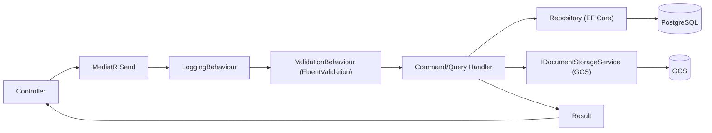

**Objaśnienie:** każdy request GUI przechodzi przez pipeline MediatR (logging → walidacja → handler). Handler korzysta z abstrakcji repo/storage.

**Wnioski:** walidacja jest centralna (behaviour), więc kontrolery są cienkie; brak logiki biznesowej w kontrolerach.

---

## 9. Frontend Angular

**Struktura:** standalone components + Signals; HTTP wyłącznie przez serwisy; `api-config.service` centralizuje `apiUrl`. Brak NgRx; RxJS używany tylko do HTTP.

**Routing (`app.routes.ts`):**

| Ścieżka | Widok |
|---|---|
| `/` | Dashboard |
| `/editor` | Edytor DOCX (`document-editor`) |
| `/viewer` | Podgląd PDF (lazy) |
| `/pdf-maintenance` | Maintenance PDF |
| `/admin` → `/admin/files` | Lista plików |
| `/admin/deliveries` | Monitoring wysyłek (lista, filtry, retry, `locked_by`) |

**Komponenty dokumentów:**
- **Edytor DOCX** (`components/document-editor`) — WYSIWYG, auto-save (timer + switch), „Zapisz"/„Pobierz", „Zakończ i wyślij" z pollingiem statusu, podpisy, kody kreskowe, linijka.
- **Podgląd PDF** (`pages/pdf-viewer`) — render przez `pdfjs-dist`, zoom, wyszukiwanie z podświetleniem.
- **Wspólny komponent klasyfikacji** (`components/document-classification-badge`) — prezentacyjny badge klasyfikacji, używany przez edytor DOCX i podgląd PDF (patrz [10](#10-model-dokumentu-i-metadanych) i [13.4](#134-wyświetlenie-klasyfikacji)).

**Obsługa błędów / braku dostępu:** globalny error handler + `http-error.interceptor`; widoki obsługują stany loading/error/not-found (np. PDF viewer: `isLoading`/`isNotFound`/`errorMessage`). **Brak dostępu (403/auth) nie jest obecnie odrębnie obsługiwany** — mechanizm auth niepotwierdzony (patrz [16](#16-bezpieczeństwo)).

**Modele i serwisy API:** `document-storage.service` (CRUD + GCS-backed operacje + wysyłka), `document.service` (operacje bezstanowe na plikach), `admin.service`, `barcode.service`.

### 9.1 Diagram wejścia użytkownika do widoku dokumentu

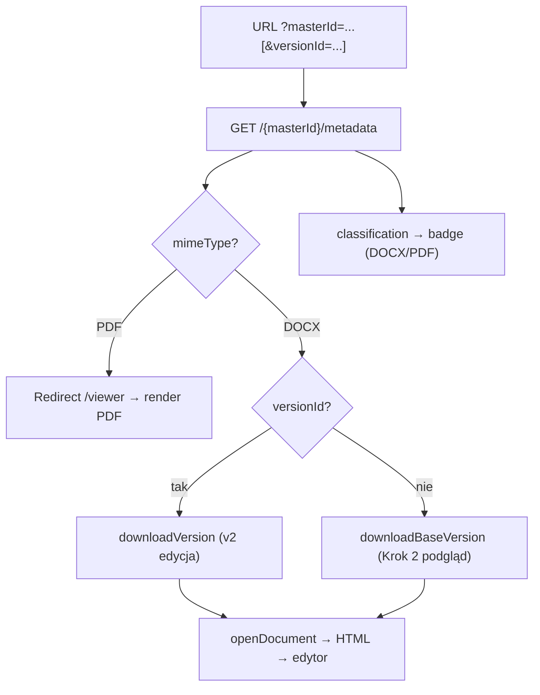

**Objaśnienie:** edytor DOCX najpierw pobiera metadane, na ich podstawie decyduje o typie pliku (PDF → przekierowanie do `/viewer`) i trybie (edycja vs read-only).

> **Nieaktualne (errata 2026-07-05):** R-02 zamknięte — tryb podglądu (`?masterId=` bez `versionId`) ładuje **wersję bazową v1** przez `downloadBaseVersion` (`GET .../{masterId}/download`).

---

## 10. Model dokumentu i metadanych

**Document (master)** — agregat-root; `Id` = `guid_master` (używany w trasach API). Ma `Name`, `MimeType`, `CreatedAt`, `CreatedBy`, `IsDeleted`, `Metadata` (JSON), `Status`, kolekcję `Versions`.

**DocumentVersion** — wersja z referencją do pliku w GCS (`StoragePath = documents/{versionId}`). v1 = oryginał (nietykalny), v2 = kopia edytowalna (DOCX). Tylko jedna aktywna naraz.

**Klasyfikacja** — wartość `C1`..`C4` (słownik domenowy, opcjonalna przy ingeście, BR-006). Przechowywana w `documents.metadata` jako JSON. Prezentowana w GUI wspólnym komponentem `document-classification-badge` (funkcjonalność **prezentacyjna** — nie wpływa na dostęp).

**Relacja DOCX/PDF:** DOCX ma v1 (oryginał) + v2 (edytowalna); PDF ma tylko v1 (brak edytowalnego duplikatu). Metadane (`returnUrl`, `classification`) są wspólne — w `documents.metadata`, niezależnie od typu pliku.

**Fallback dla brakujących metadanych:** `GetDocumentMetadataQuery` zwraca puste pola zamiast błędu, gdy metadane są puste/nieparsowalne. Badge klasyfikacji nie renderuje się dla braku/whitespace.

### 10.1 Tabela pól metadanych

| Pole | Typ | Wymagalność | Znaczenie | Wpływ na UI/API | Uwagi |
|---|---|---|---|---|---|
| `returnUrl` | string (URL) | wymagany dla DOCX, opcjonalny dla PDF | adres zwrotu pliku po „Zakończ" | warunek operacji `finish` (400 gdy brak/zły) | walidacja: absolutny http(s) |
| `classification` | string (`C1`..`C4`) | opcjonalna przy ingeście (BR-006) | poziom klasyfikacji | badge w edytorze/viewerze; pole w `/metadata` | spoza słownika → backend przepuszcza, UI pokazuje neutralnie |

> **Nieaktualne (errata 2026-07-05):** `allowedCorporateKeys`/`CorporateKey` są **zaimplementowane** — `DocumentAccessPolicy` (Domain) + `IDocumentAccessGuard` egzekwują listę na endpointach treści/metadanych (403; `Administrator` omija — BR-014, ADR-0011); `CorporateKey` pochodzi z claimu tokenu Entra (`corpKey`, case-insensitive — ADR-0021).

### 10.2 Diagram prezentacji klasyfikacji

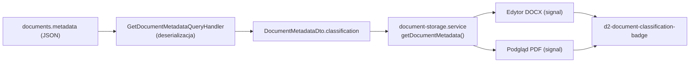

**Objaśnienie:** jedno źródło (metadane) → jeden DTO → jeden wspólny komponent badge, dla DOCX i PDF.

**Wnioski:** brak duplikacji logiki prezentacji; nieznane/puste wartości obsłużone bezpiecznie (badge nie renderuje pustego elementu).

---

## 11. Cykl życia dokumentu

Stany dokumentu (`DocumentStatus`): `Saved` → `Editing` → `Sending` → `Sent` / `DeliveryFailed`.

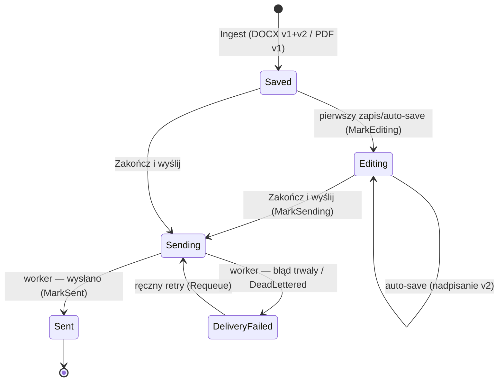

**Kroki pełnego lifecycle:**
1. **Ingest** — External API zapisuje plik (GCS) + metadane (DB). Status `Saved`.
2. **Pobranie metadanych** — GUI `GET /{masterId}/metadata` (mimeType, returnUrl, classification).
3. **Sprawdzenie dostępu** — token Entra ID (401) + rola `Operator`/`Administrator` (403, ADR-0022) + `allowedCorporateKeys` (403, BR-014); `NotFound` dla nieistniejącego zasobu.
4. **Otwarcie** — PDF → viewer; DOCX → edytor (v2 edycja lub v1/aktywna read-only).
5. **Edycja** — auto-save nadpisuje v2 w miejscu; status `Editing`.
6. **Zapis** — `PUT /{masterId}/versions/{versionId}`.
7. **Finalizacja** — `POST .../finish`: zamrożenie snapshotu (`deliveries/{id}`, SHA-256), status `Sending`, utworzenie zadania.
8. **Wysyłka** — worker wysyła snapshot na `ReturnUrl` (at-least-once, `Idempotency-Key`).
9. **Błędy/retry** — exponential backoff + jitter (cap 15 min) do 24 h → `DeadLettered`; 4xx wybrane → `FailedPermanently`.

**Punkty obserwowalności:** kolumny audytowe w `document_deliveries` (`attempt_count`, `last_error`, `correlation_id`), logi handlerów (LoggingBehaviour).

---

## 12. Cykl życia aplikacji

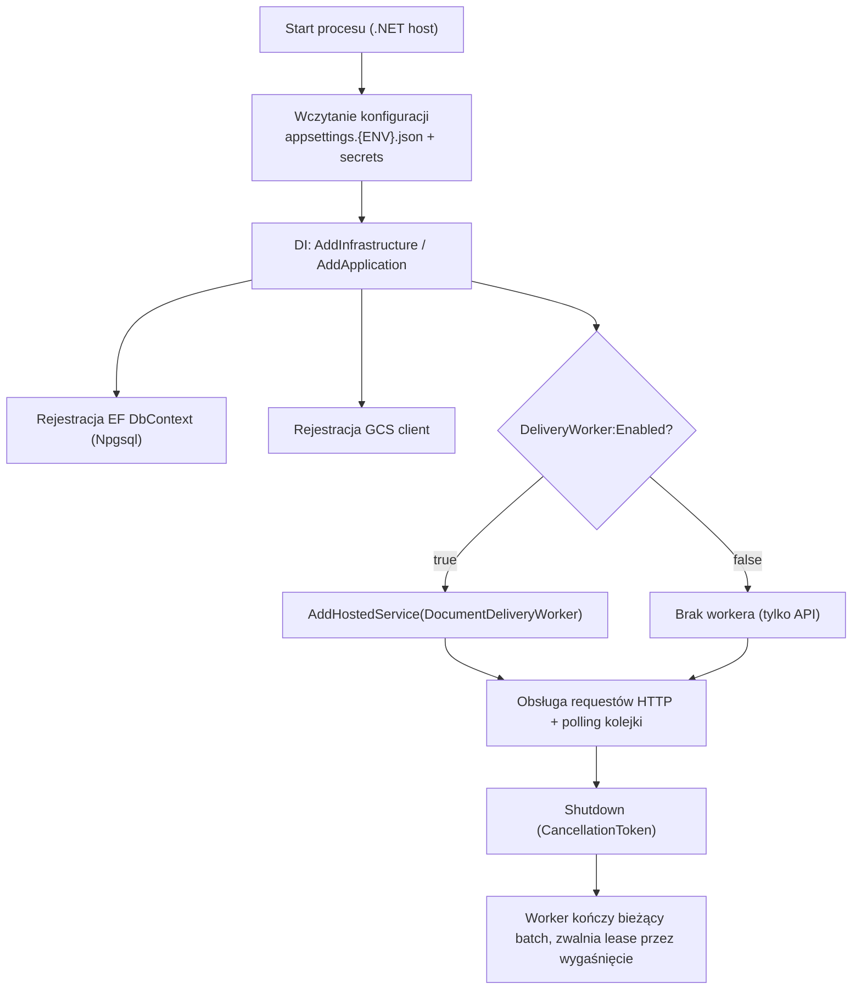

**Cykl życia requestu:** Controller → MediatR (Logging → Validation → Handler) → Repository/Storage → `Result<T>` → mapowanie HTTP.

**Połączenie z bazą/storage:** connection string z `appsettings.{ENV}.json` (sekrety poza repo); GCS z sekcji `GoogleCloudStorage` (w DEV `ApiEndpoint` fake-gcs).

**Start workerów:** worker startuje tylko gdy `DeliveryWorker:Enabled=true`; używa `PeriodicTimer` (`PollInterval`).

**Recoverability po restarcie:** zadania trwają w PostgreSQL; zadania w `Sending` z wygasłym `locked_until` są przejmowane przez kolejny worker (lease). Brak utraty zadań.

> **[Wymaga potwierdzenia]** Szczegóły graceful shutdown (timeouty hosta, drain) nie są jawnie skonfigurowane w `.ai`; zachowanie wynika z domyślnego `BackgroundService` + `CancellationToken`.

---

## 13. Przepływy krytyczne

### 13.1 Otwarcie dokumentu DOCX

**Cel:** załadować DOCX do edytora. **Aktorzy:** użytkownik, GUI, Internal API, GCS. **Wejście:** `masterId` (+ `versionId`). **Wyjście:** HTML w edytorze. **Błędy:** 404 (brak), błąd konwersji. **Observability:** logi handlerów.

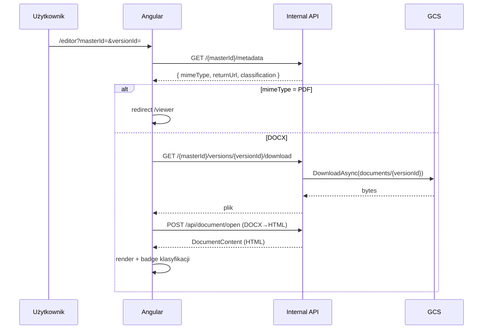

### 13.2 Podgląd PDF

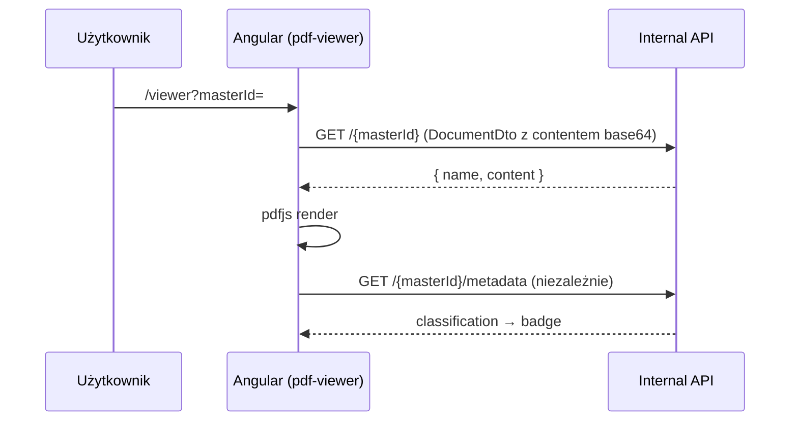

**Wniosek:** klasyfikacja jest pobierana niezależnie od treści — awaria metadanych nie blokuje renderu PDF.

### 13.3 Sprawdzenie dostępu do dokumentu

> **Zaktualizowane (errata 2026-07-05):** autoryzacja istnieje — `[Authorize]` na `BaseApiController` (Entra ID, Microsoft.Identity.Web), klasowa polityka `RequireAppOperator` na kontrolerach edytora (ADR-0022), a endpointy treści/metadanych sprawdzają `allowedCorporateKeys` względem `CorporateKey` z claimu tokenu (`IDocumentAccessGuard`, BR-014; admin omija).

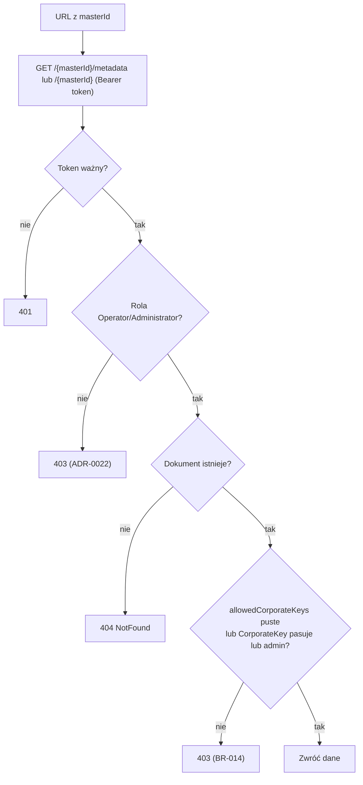

### 13.4 Wyświetlenie klasyfikacji

**Cel:** pokazać poziom klasyfikacji w obu widokach. **Wejście:** `classification` z metadanych. **Wyjście:** badge lub brak (gdy puste). Diagram danych: [10.2](#102-diagram-prezentacji-klasyfikacji).

**Reguły renderowania:** wartość znana (`C1`..`C4`) → badge z kolorem poziomu; wartość spoza słownika → badge neutralny (verbatim); brak/null/empty/whitespace → **nic** (brak pustego elementu). Klasyfikacja nie wpływa na dostęp ani ładowanie dokumentu.

### 13.5 Zapis dokumentu

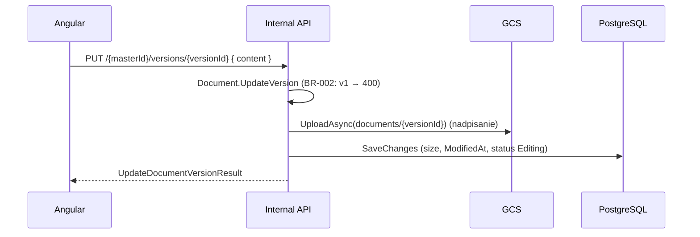

### 13.6 Finalizacja i wysyłka

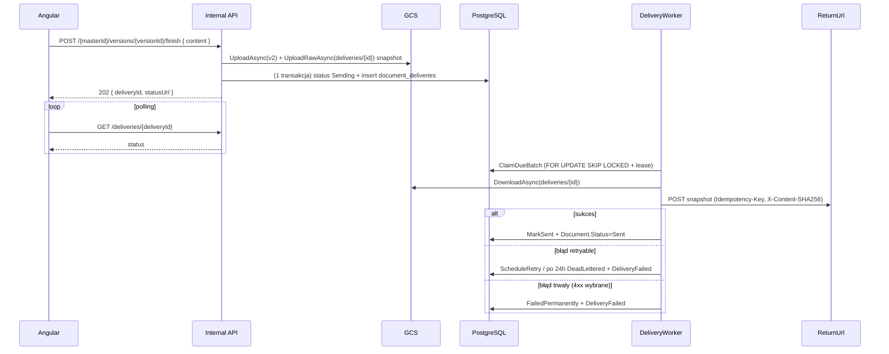

### 13.7 Pobranie pliku z GCS

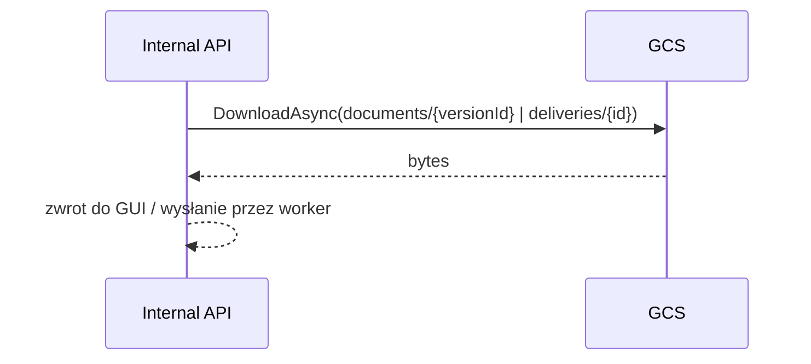

---

## 14. Integracja z systemem

> Ta sekcja jest najważniejsza dla integratorów (aplikacji źródłowych). Opisuje **potwierdzony** kontrakt External API.

### 14.1 Co integrator musi dostarczyć

1. **Plik** DOCX lub PDF (multipart, pole `File`).
2. **`Classification`** — `C1`..`C4` (opcjonalna; zła wartość → 400).
3. **`ReturnUrl`** — absolutny http(s); **wymagany dla DOCX**, opcjonalny dla PDF.
4. Opcjonalnie nagłówek `X-Created-By`.

### 14.2 Endpoint ingestu (potwierdzony)

```
POST {externalApiBase}/api/v1/document
Content-Type: multipart/form-data
```

Pola: `File`, `ReturnUrl`, `Classification`, nagłówek opcjonalny `X-Created-By`.

**Przykład (schematycznie):**

```http
POST /api/v1/document HTTP/1.1
Content-Type: multipart/form-data; boundary=----X
X-Created-By: system-zrodlowy

------X
Content-Disposition: form-data; name="File"; filename="umowa.docx"
Content-Type: application/vnd.openxmlformats-officedocument.wordprocessingml.document
<bajty pliku>
------X
Content-Disposition: form-data; name="ReturnUrl"
https://odbiorca.example/callback
------X
Content-Disposition: form-data; name="Classification"
C2
------X--
```

**Odpowiedź 201:**

```json
{ "masterId": "1111...", "versionId": "2222..." }
```

`versionId` jest zwracany tylko dla DOCX (PDF: `null`).

### 14.3 Otwarcie GUI

Integrator składa URL do GUI samodzielnie:
- podgląd: `{guiBase}/viewer?masterId={masterId}` (PDF) lub `{guiBase}/editor?masterId={masterId}` (DOCX read-only),
- edycja: `{guiBase}/editor?masterId={masterId}&versionId={versionId}`.

### 14.4 Jak działa dostęp i klasyfikacja

- **Dostęp:** (errata 2026-07-05) token Entra ID + rola aplikacyjna + opcjonalna lista `allowedCorporateKeys` w metadanych (egzekwowana backendowo, 403; admin omija — BR-014).
- **Klasyfikacja:** `C1`..`C4` (opcjonalna), prezentacyjna w GUI; nie ogranicza obecnie dostępu.

### 14.5 Wysyłka zwrotna (odbiorca `ReturnUrl`)

Odbiorca musi przyjąć **POST** z plikiem oraz obsłużyć nagłówek **`Idempotency-Key`** (dedup; wysyłka jest at-least-once) i może użyć `X-Content-SHA256` do weryfikacji integralności.

> **Potwierdzone (errata 2026-07-05):** POST zwrotny to `multipart/form-data` — części `file` (DOCX, filename `document.docx`), `masterId`, `versionId`, `corporateKey`; nagłówki `Idempotency-Key` i `X-Content-SHA256` (kod `HttpDeliverySender`). Odbiorca czyta plik z pola formularza `file`.

### 14.6 Statusy i błędy

| Sytuacja | Status |
|---|---|
| Ingest OK | 201 |
| Walidacja (zły MIME/rozmiar/Classification/brak ReturnUrl dla DOCX) | 400 |
| `finish` bez poprawnego `ReturnUrl` | 400 |
| Zasób nie istnieje | 404 |

Format błędu: `{ "error": "komunikat" }`.

### 14.7 Czego integrator NIE powinien robić

- Nie wołać Internal API bezpośrednio (to powierzchnia GUI).
- Nie zakładać kontroli dostępu po `CorporateKey` (nie istnieje).
- Nie polegać na natychmiastowej wysyłce — jest asynchroniczna (retry do 24 h).
- Nie wysyłać niezwalidowanego/zbyt dużego pliku (>100 MB → odrzucenie).

---

## 15. API

### 15.1 Internal API — `/api/documentstorage`

| Metoda | Ścieżka | Cel | Odpowiedź |
|---|---|---|---|
| GET | `/?skip=&take=` | lista dokumentów (admin) | `DocumentListItemDto[]` |
| POST | `/upload` | pierwszy zapis | `{ masterId, versionId }` |
| POST | `/{masterId}/save` | nowa wersja | `{ versionId }` |
| PUT | `/{masterId}/versions/{versionId}` | nadpisanie w miejscu (v1 → 400) | `UpdateDocumentVersionResult` |
| GET | `/{masterId}` | dokument + aktywna wersja (content) | `DocumentDto` |
| GET | `/{masterId}/metadata` | metadane | `{ masterId, mimeType, returnUrl?, classification? }` |
| GET | `/{masterId}/versions` | historia wersji | `DocumentVersionDto[]` |
| GET | `/{masterId}/download` | bajty wersji bazowej (v1) | plik |
| GET | `/{masterId}/versions/{versionId}/download` | bajty wersji | plik |
| POST | `/{masterId}/restore/{versionId}` | przywróć wersję | `{ message, versionId }` |
| POST | `/{masterId}/versions/{versionId}/finish` | „Zakończ i wyślij" | 202 `{ deliveryId, status, statusUrl }` |
| GET | `/deliveries/{deliveryId}` | status wysyłki | `DeliveryStatusDto` |
| GET | `/deliveries?status=&skip=&take=` | lista zadań (admin; domyślnie `DeadLettered`) | `DeliveryListItemDto[]` |
| POST | `/deliveries/{deliveryId}/retry` | ręczne ponowienie | `RequeueDeliveryResult` |

Inne kontrolery Internal API: `DocumentController` (`/api/document` — open/save/new/upload-image/templates/sign/verify-signatures; `export-pdf` = **501 placeholder**), `BarcodeController` (`/api/barcode`), `HealthController` (`/api/health`).

**Przykład — status wysyłki:**

```json
{
  "deliveryId": "....", "documentId": "....", "status": "RetryScheduled",
  "attemptCount": 2, "lastAttemptAt": "2026-05-26T10:00:00Z",
  "nextAttemptAt": "2026-05-26T10:02:00Z", "lastError": "502 Bad Gateway",
  "updatedAt": "2026-05-26T10:00:00Z"
}
```

### 15.2 External API — `/api/v1/document`

| Metoda | Ścieżka | Cel |
|---|---|---|
| POST | `/api/v1/document` | ingest (multipart) → 201 `{ masterId, versionId? }` |
| GET | `/api/v1/document/{documentId}` | **placeholder** (read flow niezaimplementowany) |

**Autoryzacja:** (errata 2026-07-05) Internal API — Entra ID (token + role, ADR-0022); External API — app-to-app, patrz `SECURITY.md`. **Idempotencja:** „Zakończ i wyślij" jest idempotentne (unique partial index — jedno aktywne zadanie per dokument); wysyłka HTTP używa `Idempotency-Key`.

---

## 16. Bezpieczeństwo

**Sekrety:** w `appsettings.{ENV}.secrets.json` (poza repo). Connection stringi i klucze GCS to sekrety — nie logować, nie kopiować do dokumentacji.

**Walidacja (realne mechanizmy):**
- FluentValidation na komendach (np. `IngestExternalDocumentCommandValidator`).
- Ingest: niepusty plik, MIME ∈ {DOCX, PDF}, rozmiar ≤ 100 MB, metadata = poprawny JSON ≤ 8000 znaków, `classification` ∈ {C1..C4}, `ReturnUrl` wymagany dla DOCX.
- Limity uploadu w kontrolerze (`RequestSizeLimit` ~110 MB).
- Handlery zwracają `NotFound` dla nieistniejących zasobów.

**Dostęp / autoryzacja:** **[Wymaga potwierdzenia]** — `SECURITY.md` mówi „do potwierdzenia w repo; nie zakładaj mechanizmu". Grep nie wykrył `AddAuthentication`/`[Authorize]`. **`CorporateKey`/`allowedCorporateKeys`/Entra ID nie istnieją w repo.**

**Pliki/treść:** walidacja MIME + rozszerzenie; uwaga na XSS w edytorze WYSIWYG (treść HTML od użytkownika — używać bezpiecznych mechanizmów Angulara).

**Wysyłka (returnUrl):** `RecipientUrl` walidowany jako absolutny http(s); snapshot niezmienny; klasyfikacja błędów 4xx vs retry.

**Logowanie:** nie logować haseł/tokenów/certyfikatów/PII/surowych payloadów. Structured logging (`ILogger`).

### 16.1 Diagram przepływu dostępu (stan obecny)

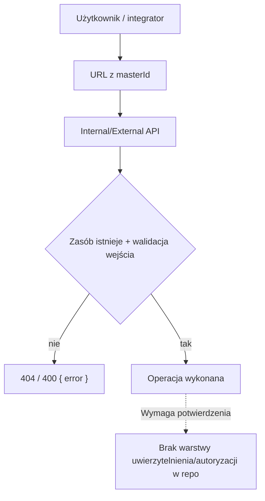

> **Rekomendacja (nie stan obecny):** rozważyć SSRF-guard dla `RecipientUrl` (allowlista hostów, blokada adresów prywatnych i `169.254.169.254`) oraz docelowo uwierzytelnianie (np. Entra ID — **jeśli** zostanie zdecydowane; obecnie brak w repo).

---

## 17. Google Cloud Storage

**Rola:** przechowywanie plików binarnych (baza trzyma tylko `storage_path`). Bucket: `d2viewereditor-documents`. W DEV: fake-gcs-server (`ApiEndpoint` w `appsettings.DEV.json`).

**Obiekty:**
- wersje dokumentu: `documents/{versionId}`,
- snapshoty wysyłki: `deliveries/{deliveryId}` (niezmienne, SHA-256).

**Abstrakcja:** `IDocumentStorageService` / `GcsDocumentStorageService` — `UploadAsync`, `UploadRawAsync`, `DownloadAsync`, (oraz operacje pomocnicze). Re-upload pod tym samym `versionId` zastępuje obiekt (płaski model v2).

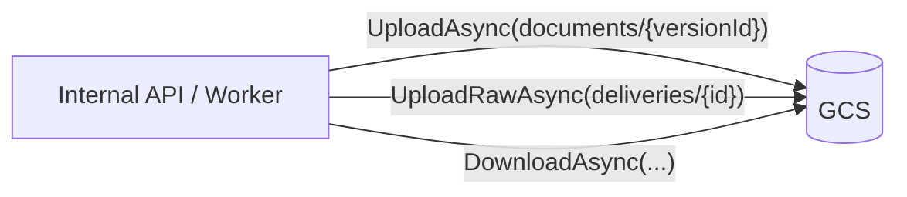

> **[Wymaga potwierdzenia]** Strategia retry/timeoutów po stronie klienta GCS oraz polityki bucketu (wersjonowanie, retencja, IAM) nie są opisane w `.ai`.

---

## 18. PostgreSQL

**Rola:** metadane dokumentów/wersji + kolejka wysyłki. **ORM:** EF Core 8 + Npgsql. **Migracje:** ręczny SQL w `infra/sql/` (001–007), **nie EF Migrations**.

**Tabele:**
- `documents` — `id`, `name`, `mime_type`, `created_at`, `created_by`, `is_deleted`, `metadata` (JSON), `status`. Indeksy: `created_at`, `is_deleted`.
- `document_versions` — `id`, `document_id` (FK cascade), `storage_path`, `size_in_bytes`, `version_number`, `created_at`, `created_by`, `is_active`, `modified_at`. Indeksy: `document_id`, `(document_id, is_active)`, `created_at`.
- `document_deliveries` — kolejka wysyłki (patrz [19](#19-background-jobs--workery)).

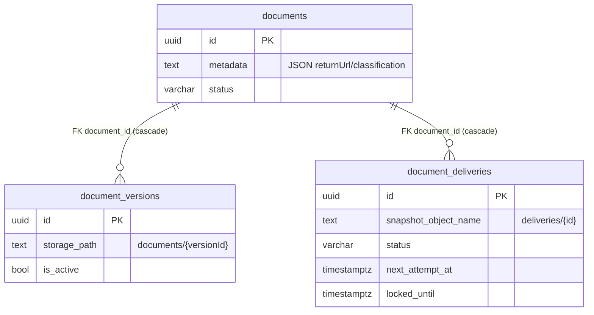

**Transakcyjność:** `FinishAndSend` zmienia status dokumentu i tworzy zadanie w jednym `SaveChanges` (spójność bez outboxa). **Migracje:** dodawaj kolumny `ADD COLUMN IF NOT EXISTS` + mapowanie w `*Configuration`; zmiany destrukcyjne wymagają osobnej decyzji.

---

## 19. Background jobs / workery

**`DocumentDeliveryWorker` (`BackgroundService`)** — hostowany w procesie Internal API; wysyła finalne pliki na `ReturnUrl`.

**Konfiguracja (`appsettings.json` → `DeliveryWorker`):** `Enabled`, `PollInterval` (15 s), `BatchSize` (20), `MaxConcurrency` (4), `Lease` (5 min), `RetentionWindow` (24 h), `HttpTimeout` (30 s).

**Pobieranie zadań:** `DocumentDeliveryRepository.ClaimDueBatchAsync` — `SELECT ... FOR UPDATE SKIP LOCKED` + lease (`locked_until`/`locked_by`), atomowo ustawia `Sending`, inkrementuje `attempt_count`. CTE bierze zadania gotowe (`Pending`/`RetryScheduled` z `next_attempt_at <= now()`) ORAZ zawieszone (`Sending` z wygasłym lease — reclaim po crashu).

**Retry/recoverability:** exponential backoff + full jitter (cap 15 min) do 24 h → `DeadLettered`; 4xx wybrane (400/401/403/404/405/422) → `FailedPermanently`; wiele instancji bezpiecznych dzięki SKIP LOCKED; brak utraty zadań (stan w DB).

**Idempotencja:** unique partial index `ux_document_deliveries_active_per_document` — jedno aktywne zadanie per dokument; POST z `Idempotency-Key = deliveryId`.

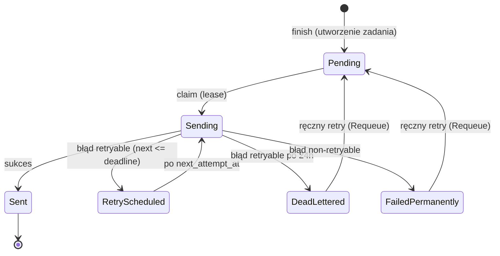

**Monitoring:** `GET /deliveries?status=` + widok GUI `/admin/deliveries` (status, próby, `locked_by`, ostatni błąd, retry). SQL liczności: `SELECT status, count(*) FROM document_deliveries GROUP BY status`.

---

## 20. Deployment i środowiska

**Obrazy Docker (w repo):**

| Obraz | Plik | Bazowy | Port |
|---|---|---|---|
| Internal API | `docker/api.dockerfile` | `dotnet/aspnet:8.0` | 8080 |
| GUI | `docker/gui.dockerfile` | nginx:1.27-alpine (build node:22) | 80 |
| External API | `D2ServicesViewerEditor/Dockerfile` | `dotnet/aspnet:8.0` | 80/443 |

**Środowiska konfiguracji:** Internal — DEV/UAT/PRD; External — dev/tst/acc/prd/local. Jawna konfiguracja w `appsettings.{ENV}.json`; sekrety w `appsettings.{ENV}.secrets.json` (poza repo).

**Porty DEV:** Internal API 5190/7190 (Swagger `/swagger`), External API 15112 (`Urls` w `appsettings.json`), GUI 4200.

**Zależności infrastrukturalne:** PostgreSQL (schemat = skrypty `infra/sql/` 001–007), GCS/fake-gcs (bucket `d2viewereditor-documents`).

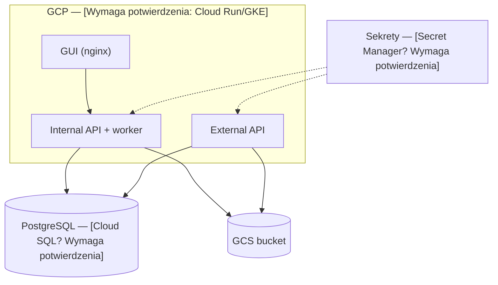

> **[Wymaga potwierdzenia / Brak w repo]** Brak IaC i `docker-compose`. Konkretne usługi GCP (Cloud Run vs GKE), Cloud SQL, Secret Manager, IAM, sposób migracji schematu na środowiskach i podmiana `apiUrl` frontu przy deployu — nieustalone w repo.

**Migracje na środowisku:** uruchomienie skryptów `infra/sql/` w kolejności (idempotentne — `IF NOT EXISTS`). **Rollback:** brak zautomatyzowanego mechanizmu; zmiany destrukcyjne wymagają osobnej decyzji.

---

## 21. CI/CD

> **[Brak w repo]** Nie znaleziono `.github/workflows`, `.gitlab-ci.yml` ani innego pipeline.

Typowy docelowy łańcuch (rekomendacja, nie stan obecny):

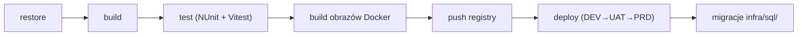

**Komendy weryfikacji lokalnej:** `dotnet build/test D2ViewerEditor.sln`, `npm run build`, `npm test`. Brak `npm run lint`.

---

## 22. Observability

**Stan potwierdzony:** structured logging przez `ILogger` + `LoggingBehaviour` (MediatR); `correlation_id` w `document_deliveries`; ślad audytowy wysyłki (`attempt_count`, `last_error`, `last_attempt_at`); health check (`/api/health`); panel `/admin/deliveries`.

> **[Wymaga potwierdzenia / Brak w repo]** Brak potwierdzonego systemu metryk/tracingu/alertów (Prometheus/OpenTelemetry/Grafana). Występują w `.ai` jako rekomendacje, nie jako wdrożony stan.

| Sygnał | Źródło | Ważność | Co oznacza | Reakcja operacyjna |
|---|---|---|---|---|
| Wzrost `DeadLettered` | `document_deliveries` / `/admin/deliveries` | wysoka | odbiorca `ReturnUrl` niedostępny >24 h | sprawdzić odbiorcę, rozważyć retry |
| Wzrost `FailedPermanently` | jw. | wysoka | trwałe 4xx od odbiorcy | zweryfikować kontrakt odbiorcy |
| Zadania `Sending` z wygasłym lease | `ix_..._stuck` | średnia | crash/zawieszenie workera | sprawdzić logi/instancje workera |
| 5xx Internal API | logi | wysoka | błąd backendu | runbook [23](#23-runbook-operacyjny) |
| 404 masowo | logi | średnia | złe `masterId` u integratora | troubleshooting [24](#24-troubleshooting-dla-integratorów) |

---

## 23. Runbook operacyjny

> Format: objawy → możliwe przyczyny → co sprawdzić → gdzie logi → naprawa → eskalacja.

| Scenariusz | Objawy | Możliwe przyczyny | Co sprawdzić / gdzie | Naprawa | Eskalacja |
|---|---|---|---|---|---|
| Aplikacja nie startuje | proces pada przy starcie | zły connection string / brak sekretów / GCS niedostępny | logi startu; `appsettings.{ENV}.secrets.json` | poprawić konfigurację, sprawdzić DB/GCS | DevOps |
| Frontend nie ładuje dokumentu | spinner/„Nie można pobrać" | API down / złe `apiUrl` / CORS | konsola przeglądarki; `environment.*`; `/api/health` | poprawić `apiUrl`/CORS, podnieść API | dev |
| 403 z backendu | odmowa | **[Wymaga potwierdzenia]** brak auth — 403 nietypowy; sprawdzić middleware | logi API | zależne od (niepotwierdzonego) mechanizmu | architekt |
| 500 z backendu | błąd serwera | wyjątek w handlerze / DB/GCS | logi API (correlation) | naprawić przyczynę | dev/DevOps |
| Dokument nie istnieje | 404 | zły `masterId` / soft-deleted | DB `documents` | zweryfikować id u integratora | support |
| Plik nie pobiera się z GCS | błąd pobrania | bucket/endpoint/uprawnienia | konfiguracja `GoogleCloudStorage`; logi | poprawić dostęp do GCS | DevOps |
| PDF nie wyświetla | pusty viewer | uszkodzony plik / błąd pdfjs / brak workera | konsola; `pdf.worker.min.mjs` w assets | sprawdzić plik/asset | dev |
| DOCX nie otwiera się | błąd konwersji | uszkodzony DOCX / błąd OpenXml | logi `/api/document/open` | zweryfikować plik | dev |
| Klasyfikacja nie widoczna | brak badge | brak/puste `classification` w metadanych | `GET /{masterId}/metadata` | uzupełnić metadane przy ingeście | integrator |
| User bez dostępu widzi edytor | brak kontroli | **[Wymaga potwierdzenia]** brak warstwy auth | — | decyzja zespołu o auth | architekt |
| Worker nie przetwarza zadań | zadania wiszą w `Pending` | `DeliveryWorker:Enabled=false` / brak instancji | konfiguracja; logi workera | włączyć worker | DevOps |
| Retry nie działa | brak ponowień | błąd sklasyfikowany jako `FailedPermanently` / deadline | `last_error`, `status` w `document_deliveries` | ręczny `Requeue` po naprawie odbiorcy | DevOps |
| Baza niedostępna | błędy DB | Postgres down / sieć | `/api/health`; logi | przywrócić DB | DevOps |
| Storage niedostępny | błędy GCS | GCS/fake-gcs down | logi; endpoint GCS | przywrócić storage | DevOps |

---

## 24. Troubleshooting dla integratorów

| Problem | Możliwa przyczyna | Jak zweryfikować | Rozwiązanie |
|---|---|---|---|
| Ingest 400 | zła `Classification` / brak `ReturnUrl` (DOCX) / zły MIME / >100 MB | komunikat `{ error }` | poprawić pola wejściowe |
| Brak klasyfikacji w GUI | nie wysłano `Classification` lub złe metadane | `GET /{masterId}/metadata` | wysłać `C1`..`C4` przy ingeście |
| `allowedCorporateKeys` „nie działa" | **mechanizm nie istnieje w repo** | — | nie polegać na nim; potwierdzić wymaganie z zespołem |
| User bez „CorporateKey" widzi dokument | brak warstwy dostępu | — | **[Wymaga potwierdzenia]** decyzja o auth |
| Zły link | błędny `masterId`/`versionId` | 404 | użyć id zwróconych przez ingest |
| Zły format pliku | MIME spoza {DOCX, PDF} | 400 | wysłać obsługiwany format |
| Brak pliku w storage | błąd po stronie storage | logi/operacje | eskalacja do DevOps |
| Wysyłka nie dotarła | odbiorca niedostępny / 4xx | `GET /deliveries/{id}` (`status`, `lastError`) | naprawić odbiorcę, `retry` |

---

## 25. Konwencje projektowe

- **Backend:** Clean Architecture; kontrolery cienkie; logika w Application/Domain; `Result<T>`; format błędu `{ error }`; walidacja FluentValidation.
- **Baza:** ręczny SQL w `infra/sql/` (numerowany) + mapowanie w `*Configuration`; **nie generować migracji EF**.
- **API:** brak breaking changes bez decyzji; Internal bez wersji w ścieżce, External `/api/v1`.
- **Angular:** standalone + Signals; HTTP w serwisach; `api-config` centralizuje `apiUrl`; brak bezpośredniego `HttpClient` w komponentach.
- **Testy:** NUnit (backend), Vitest (frontend); nie usuwać testów dla „zielonego" buildu.
- **Dokumentacja:** aktualizować `.ai/CURRENT_STATE`, `TASK_HANDOFF`, `CHANGELOG` po istotnej pracy; decyzje → `DECISIONS.md`.
- **Sekrety:** nigdy w repo.

---

## 26. Testowanie

**Typy testów:** jednostkowe (Domain/Application/Infrastructure/Api — NUnit), integracyjne DB (`Infrastructure.IntegrationTests` — claim wysyłki na realnym PostgreSQL, **gated** env-varem `RUN_DB_INTEGRATION_TESTS=1`), frontend (Vitest), benchmarki (BenchmarkDotNet).

**Uruchamianie:**

```bash
# Backend
dotnet test D2ApiViewerEditor/D2ViewerEditor.sln
# Integracyjne DB (wymaga Postgres + migracje 001..011)
RUN_DB_INTEGRATION_TESTS=1 dotnet test .../D2ViewerEditor.Infrastructure.IntegrationTests
# Frontend
cd D2GuiViewerEditor && npm test
```

**Co testować:** reguły wersji (v1 immutable, płaski zapis v2), parsowanie metadanych/klasyfikacji, finish-and-send (idempotencja, snapshot), claim wysyłki (SKIP LOCKED, reclaim, unique index), komponent klasyfikacji (render/fallback).

**Checklista testowa dla zmian w obszarze dokumentów:**
- [ ] reguły wersji nienaruszone (v1 immutable, v2 nadpisanie),
- [ ] metadane: brak/null/empty/whitespace/zły JSON obsłużone,
- [ ] klasyfikacja: znana/nieznana/pusta → poprawny render badge,
- [ ] finish-and-send idempotentne,
- [ ] brak regresji w claimie wysyłki,
- [ ] frontend: loading/error/empty,
- [ ] testy backendu i frontu zielone.

---

## 27. Decyzje architektoniczne

| Decyzja | Kontekst | Konsekwencje | Status | Źródło |
|---|---|---|---|---|
| `.ai/` jako pamięć projektu | praca z agentami AI | stały kontekst; wymaga dyscypliny | Accepted | ADR-0001 |
| Metadane jako JSON w jednej kolumnie | rozszerzalne metadane (returnUrl, classification) | elastyczność; brak indeksu po classification | Accepted | ADR-0002 |
| Płaski zapis v2 (nadpisanie w miejscu) | auto-save mnożyłby wersje | brak przyrostu w GCS; brak rollbacku auto-save | Accepted | ADR-0003 |
| „Zapisz"=API, „Pobierz"=lokalnie | wcześniej „Zapisz" tylko pobierał | spójna ścieżka zapisu | Accepted | ADR-0004 |
| „Zakończ i wyślij" = kolejka PostgreSQL + worker (bez brokera) | trwała, odporna wysyłka z retry 24 h | zero nowej infry; koszt = polling DB | Accepted | ADR-0005 |

---

## 28. Ograniczenia, ryzyka i dług techniczny

**Fakty (potwierdzone):**
- Brak CI/CD i `docker-compose` w repo (R-01).
- ~~Tryb podglądu (Krok 2) ładuje aktywną wersję~~ **Zamknięte** — podgląd ładuje v1 (R-02 Closed).
- `RecipientUrl` — SSRF częściowo zmitygowane `ReturnUrlValidator` (loopback/private IP/allowlista, ADR-0024); pozostaje DNS-rebind + obowiązkowa allowlista prod (R-07 Partial).
- Schemat bazy poza EF Migrations (świadome) — bootstrap = ręczne skrypty (`infra/sql/` 001..011).
- ~~Mechanizm auth niepotwierdzony~~ **Zamknięte** — Entra ID + role + `allowedCorporateKeys` zaimplementowane (A-05 Closed; ADR-0011/0012/0022).
- Read flow External API (`GET /api/v1/document/{id}`) to placeholder — nadal aktualne.
- `export-pdf` = 501 (placeholder) — nadal aktualne.

**Dług techniczny / braki dokumentacji:**
- brak IaC GCP, brak opisu polityk bucketu/IAM,
- ~~brak potwierdzonego kształtu POST-u zwrotnego~~ potwierdzone: `multipart/form-data`,
- brak metryk/alertów (tylko logi + audyt w DB),
- skaner AV uploadu = `NoOpFileScanner` (R-28).

---

## 29. Rekomendacje Principal DevOps

> Rekomendacje, **nie stan obecny**.

**Krótkoterminowe:**
- SSRF-guard dla `RecipientUrl` (allowlista hostów/schematów, blokada adresów prywatnych i `169.254.169.254`).
- Doprecyzować i udokumentować kontrakt POST-u zwrotnego (`Content-Type`, body).
- Dodać alerting na wzrost `DeadLettered`/`FailedPermanently`.

**Średnioterminowe:**
- Pipeline CI/CD (build → test → obrazy → deploy) + automatyczne uruchamianie migracji `infra/sql/`.
- `docker-compose` dla lokalnego startu (API + External + GUI + Postgres + fake-gcs).
- Observability: OpenTelemetry (tracing z `correlation_id`), metryki kolejki wysyłki, dashboard.
- Naprawa Kroku 2 (podgląd ładuje v1 przez `/download`).

**Długoterminowe:**
- Decyzja i implementacja uwierzytelniania/autoryzacji (np. Microsoft Entra ID — **jeśli** zdecydowane).
- IaC dla GCP (Cloud Run/GKE, Cloud SQL, Secret Manager, IAM).
- Polityki bucketu GCS (wersjonowanie, retencja, szyfrowanie kluczami zarządzanymi).

---

## 30. Słownik pojęć

| Termin | Znaczenie |
|---|---|
| Document / master | agregat-root; `Id` = guid_master (trasy API) |
| DocumentVersion | wersja z plikiem w GCS; v1 oryginał (nietykalny), v2 edytowalna |
| MasterId / VersionId | GUID-y zwracane po ingeście; integrator składa z nich URL do GUI |
| Metadane | JSON w `documents.metadata` (`returnUrl`, `classification`) |
| Classification | poziom `C1`..`C4`; opcjonalny przy ingeście; prezentacyjny w GUI |
| ReturnUrl | URL zwrotu pliku po „Zakończ"; wymagany dla DOCX |
| DOCX / PDF | obsługiwane formaty (edycja / podgląd) |
| GCS | Google Cloud Storage; obiekty `documents/{versionId}`, `deliveries/{deliveryId}` |
| Worker | `DocumentDeliveryWorker` (`BackgroundService`) — wysyłka w tle |
| Finalizacja | „Zakończ i wyślij" — snapshot + zadanie wysyłki |
| DocumentDelivery / DeliveryStatus | zadanie wysyłki / jego status (Pending…DeadLettered) |
| Snapshot | niezmienny plik wysyłki `deliveries/{id}` (SHA-256) |
| SKIP LOCKED / Lease | bezpieczny claim wielu instancji / techniczna dzierżawa (`locked_until`) |
| Idempotency-Key | nagłówek POST = `deliveryId` (dedup u odbiorcy) |
| Integrator | aplikacja źródłowa korzystająca z External API |
| CorporateKey / allowedCorporateKeys | **[Brak w repo]** pojęcie z promptu, niezaimplementowane |

---

## 31. Źródła

**Pliki `.ai`:** `PROJECT_CONTEXT.md`, `ARCHITECTURE.md`, `DOMAIN.md`, `DATABASE.md`, `API_CONTRACTS.md`, `SECURITY.md`, `DEVOPS_DEPLOYMENT.md`, `DECISIONS.md`, `TECH_STACK.md`, `GLOSSARY.md`, `FEATURES.md`, `PRODUCT_GOALS.md`, `CURRENT_STATE.md`, `TASK_HANDOFF.md`, `RISKS_ASSUMPTIONS.md`, `CHANGELOG.md`, `confluence-documentation.md`.

**Kod (istotny):** `D2ViewerEditor.Domain/Entities/{Document,DocumentVersion,DocumentDelivery}.cs`; `Application/Features/Documents/Queries/GetDocumentMetadata/*`; `Application/Features/Documents/Commands/FinishAndSendDocument/*`; `Infrastructure/Persistence/Repositories/DocumentDeliveryRepository.cs`; `Api/Controllers/DocumentStorageController.cs`; `infra/sql/001..011`; `D2GuiViewerEditor/src/app/{pages/pdf-viewer, components/document-editor, components/document-classification-badge, services/document-storage.service.ts, app.routes.ts}`; `docker/*.dockerfile`; `appsettings*.json`.

**Recon (negatywny — potwierdzony brak):** brak `AddAuthentication`/`[Authorize]`, brak `CorporateKey`/`allowedCorporateKeys`/Entra ID (poza `template/`), brak `.github/workflows`/`docker-compose`.

---

## 32. Nierozstrzygnięte niespójności i braki

| # | Opis | Status |
|---|---|---|
| 1 | **Mechanizm dostępu/auth** — `SECURITY.md` i prompt sugerują kontrolę dostępu, ale w kodzie brak warstwy auth | Wymaga potwierdzenia / decyzji |
| 2 | **`CorporateKey` / `allowedCorporateKeys`** — wymagane przez prompt integracyjny, **nie istnieją** w `.ai`/kodzie tego repo | Brak w repo |
| 3 | **Microsoft Entra ID** — wspomniane jako „przyszła integracja", brak śladów w repo | Brak w repo (rekomendacja) |
| 4 | **POST zwrotny do `ReturnUrl`** — dokładny `Content-Type`/body nieopisane w `.ai` | Wymaga potwierdzenia (kod `HttpDeliverySender`) |
| 5 | **Infrastruktura GCP** — Cloud Run/GKE, Cloud SQL, Secret Manager, IAM | Wymaga potwierdzenia (brak IaC) |
| 6 | **CI/CD** — brak pipeline w repo | Brak w repo |
| 7 | **Metryki/tracing/alerty** — tylko rekomendacje | Brak w repo |
| 8 | **Krok 2 (podgląd)** — ładował aktywną wersję (v2) | Rozstrzygnięte: podgląd ładuje v1 (R-02 Closed) |
| 9 | **Graceful shutdown / polityki retry GCS** — nieopisane | Wymaga potwierdzenia |
```
