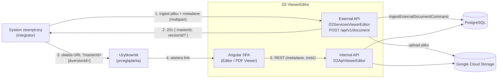
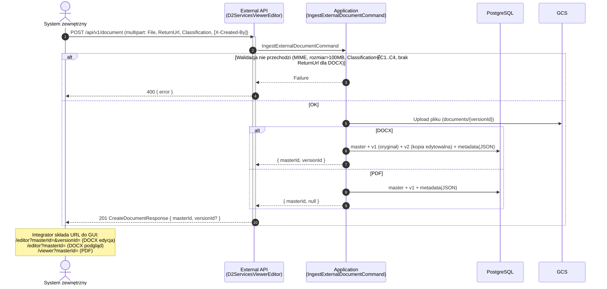
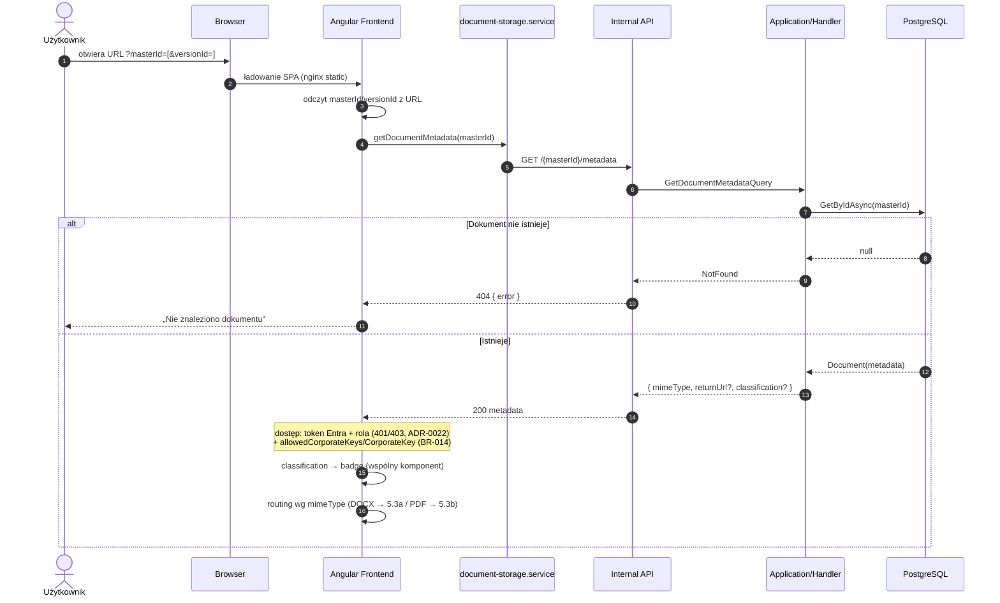
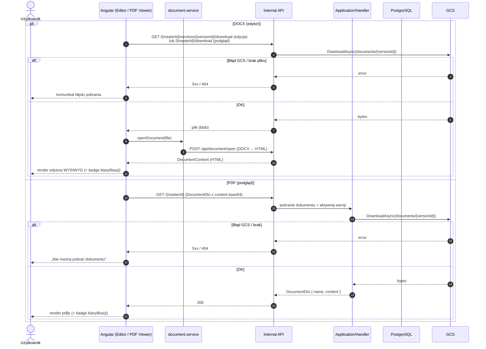
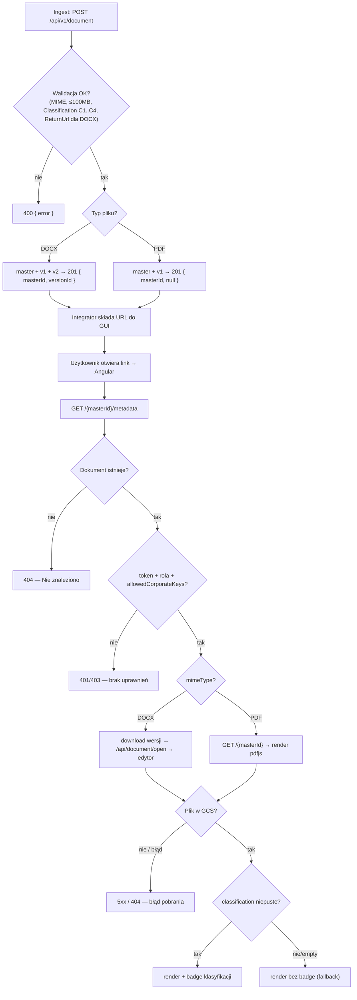

# Diagram komunikacji: zewnętrzne API i otwarcie pliku w przeglądarce

> Źródło prawdy: `.ai/` + kod (stan 2026-05-26). Elementy niepotwierdzone oznaczono **[Wymaga potwierdzenia]** / **[Brak w repo]**.
>
> **ERRATA (2026-07-05):** od czasu snapshotu zaimplementowano to, co poniżej oznaczono jako „brak warstwy auth": Internal API wymaga tokenu **Entra ID** + roli `Operator`/`Administrator` (401/403, ADR-0011/0012/0022), a `CorporateKey`/`allowedCorporateKeys` **istnieją** i są egzekwowane (BR-014, 403). Zwrot na `ReturnUrl` to potwierdzone **`multipart/form-data`** (części `file`/`masterId`/`versionId`/`corporateKey` + `Idempotency-Key`/`X-Content-SHA256`). Adnotacje „[Wymaga potwierdzenia] brak auth" w diagramach poniżej opisują stan historyczny — aktualny stan: `SECURITY.md`, `API_CONTRACTS.md`.

## 1. Cel dokumentu

Dokument pokazuje pełną komunikację: od wywołania **External API** przez system zewnętrzny (ingest dokumentu), przez złożenie linku do GUI, po otwarcie dokumentu w przeglądarce (Angular → Internal API → PostgreSQL/GCS → edytor DOCX / podgląd PDF). Przeznaczony dla zespołów backend/frontend, DevOps, architektów, **integratorów** i utrzymania.

Scenariusze: ingest DOCX/PDF, otwarcie podglądu/edycji, rozdział DOCX/PDF, obsługa błędów integracyjnych i dostępowych.

## 2. Zakres

- komunikacja przez zewnętrzne API (ingest),
- przygotowanie danych dokumentu i model linku do GUI,
- otwarcie dokumentu w przeglądarce + start frontendu,
- komunikacja frontendu z Internal API,
- pobranie metadanych (mimeType, returnUrl, classification),
- dostęp do pliku przez backend (GCS),
- rozróżnienie DOCX/PDF,
- obsługa błędów (400/404/500 + GCS).

## 3. Źródła i założenia

**Pliki `.ai`:** `API_CONTRACTS.md`, `PROJECT_CONTEXT.md`, `ARCHITECTURE.md`, `DOMAIN.md`, `DATABASE.md`, `SECURITY.md`, `DEVOPS_DEPLOYMENT.md`, `GLOSSARY.md`.

**Kod (potwierdzony):** `D2ServicesViewerEditor` (External API — ingest `POST /api/v1/document`), `Api/Controllers/DocumentStorageController.cs` (Internal API), `D2GuiViewerEditor/src/app/{components/document-editor, pages/pdf-viewer, services/document-storage.service.ts, app.routes.ts}`, `Infrastructure` (GCS).

**Potwierdzone założenia:**
- Ingest: `POST /api/v1/document` (multipart) → `201 { masterId, versionId? }`; `versionId` tylko dla DOCX.
- **Link do GUI składa system zewnętrzny sam** z `MasterId`/`VersionId` (`?masterId=[&versionId=]`) — aplikacja nie generuje/zwraca gotowego URL.
- GUI rozmawia wyłącznie z Internal API; system zewnętrzny nie woła Internal API.
- Klasyfikacja `C1..C4` w `documents.metadata` (JSON), prezentacyjna.

**Wymaga potwierdzenia (stan po erracie 2026-07-05):**
- ~~Autoryzacja/dostęp — brak warstwy auth~~ **Nieaktualne:** auth Entra ID + role + `allowedCorporateKeys` zaimplementowane (patrz ERRATA wyżej).
- Read flow External API (`GET /api/v1/document/{id}`) = placeholder — nadal aktualne.
- ~~Kształt POST zwrotnego na `ReturnUrl`~~ **Potwierdzone:** `multipart/form-data` (patrz ERRATA).

---

## 4. Diagram kontekstu integracji



**Objaśnienie:** integracja jest dwufazowa — najpierw ingest (External API), potem otwarcie GUI po linku, który **składa integrator** z otrzymanych identyfikatorów. Internal API obsługuje wyłącznie GUI.

**Wnioski:** integrator potrzebuje dwóch rzeczy: (a) wysłać plik + metadane na External API, (b) zbudować URL do GUI. Nie ma „magicznego" linku zwracanego przez backend.

---

## 5. Diagram sekwencji komunikacji

### 5.1 Faza A — ingest przez zewnętrzne API



### 5.2 Faza B — otwarcie linku, start frontendu, pobranie metadanych



### 5.3 Faza C — pobranie i renderowanie treści



**Objaśnienie (5.1–5.3):** ingest tworzy stan (DB + GCS) i zwraca identyfikatory; otwarcie GUI startuje od metadanych (decyzja typu pliku + klasyfikacja), a treść jest pobierana z GCS przez Internal API. DOCX przechodzi dodatkowo przez bezstanową konwersję `/api/document/open`.

---

## 6. Diagram decyzji i wariantów



**Objaśnienie:** flowchart łączy fazę ingest (walidacja, typ pliku) z fazą otwarcia (istnienie, dostęp — token Entra + rola + `allowedCorporateKeys`, typ, plik w GCS, klasyfikacja). Brak klasyfikacji jest pokazany jako wariant zgodny ze stanem faktycznym (pole opcjonalne).

---

## 7. Objaśnienie przepływu krok po kroku

1. **Wywołanie zewnętrznego API:** `POST /api/v1/document` (multipart): `File`, `ReturnUrl` (wymagany dla DOCX), `Classification` (C1..C4), opcjonalny nagłówek `X-Created-By`.
2. **Przygotowanie dokumentu:** walidacja → zapis pliku w GCS + metadanych w PostgreSQL → `201 { masterId, versionId? }`.
3. **Otwarcie linku:** integrator składa URL GUI z identyfikatorów (`/editor?masterId=&versionId=`, `/editor?masterId=`, `/viewer?masterId=`).
4. **Start frontendu:** nginx serwuje SPA; Angular odczytuje `masterId`/`versionId` z URL.
5. **Pobranie metadanych:** `GET /{masterId}/metadata` → `{ mimeType, returnUrl?, classification? }`; 404 gdy brak.
6. **Sprawdzenie dostępu:** token Entra ID (401 bez tokenu) + rola `Operator`/`Administrator` (403, ADR-0022) + `allowedCorporateKeys` na endpointach treści/metadanych (403, BR-014).
7. **Render DOCX:** download wersji z GCS → `POST /api/document/open` (DOCX→HTML) → edytor.
8. **Render PDF:** `GET /{masterId}` (content base64) → pdfjs.
9. **Błędy:** 400/422 (walidacja ingestu), 401 (brak tokenu), 403 (rola/dostęp), 404 (dokument/plik), 5xx (GCS/techniczne).

---

## 8. Kontrakt integracyjny

### 8.1 Potwierdzone (External API)

| Element | Wartość |
|---|---|
| Endpoint | `POST {externalApiBase}/api/v1/document` |
| Content-Type | `multipart/form-data` |
| Pole `File` | plik DOCX lub PDF (≤100 MB) — wymagane |
| Pole `Classification` | `C1`..`C4` — wymagane (zła wartość → 400) |
| Pole `ReturnUrl` | absolutny http(s) — **wymagany dla DOCX**, opcjonalny dla PDF |
| Nagłówek `X-Created-By` | opcjonalny |
| Odpowiedź | `201 CreateDocumentResponse { masterId, versionId? }` (`versionId` tylko DOCX) |
| Metadane w DB | `documents.metadata` = `{ "returnUrl": "...", "classification": "C2" }` |
| Link do GUI | **składany przez integratora**: `?masterId=[&versionId=]` |

### 8.2 Do potwierdzenia

| Element | Status |
|---|---|
| Dokładny kształt body POST zwrotnego na `ReturnUrl` | **Potwierdzone (2026-06-11/17):** `multipart/form-data` — `file`/`masterId`/`versionId`/`corporateKey` (`HttpDeliverySender`) |
| Autoryzacja External/Internal API | **Zaimplementowane:** Internal = Entra ID (token + role, ADR-0022); External = app-to-app (patrz `SECURITY.md`) |
| `allowedCorporateKeys` / `CorporateKey` | **Zaimplementowane** (BR-014, ADR-0011/0021) — egzekwowane backendowo (403) |
| Read flow `GET /api/v1/document/{id}` | Placeholder — niezaimplementowany |

---

## 9. Endpointy i komponenty (potwierdzone)

**External API:** `POST /api/v1/document` (ingest), `GET /api/v1/document/{id}` (placeholder).

**Internal API (używane przez GUI):** `GET /{masterId}/metadata`, `GET /{masterId}`, `GET /{masterId}/download`, `GET /{masterId}/versions/{versionId}/download`, `POST /api/document/open` (DOCX→HTML).

**Frontend:** komponenty `document-editor`, `pages/pdf-viewer`, `document-classification-badge`; serwisy `document-storage.service`, `document.service`; routing `app.routes.ts` (`/editor`, `/viewer`).

**Backend handlery:** `IngestExternalDocumentCommand`, `GetDocumentMetadataQuery`.

**Integracje:** PostgreSQL (`documents`/`document_versions`), GCS (`documents/{versionId}`).

---

## 10. Obsługa błędów

| Kod / sytuacja | Gdzie powstaje | Co widzi integrator | Co widzi użytkownik | Co sprawdzić w logach | Ponowienie |
|---|---|---|---|---|---|
| 400 / invalid request | External API (walidacja ingestu) | `400 { error }` | — | komunikat walidacji (MIME/rozmiar/Classification/ReturnUrl) | tak, po korekcie |
| 401 / unauthorized | Internal API (brak/nieważny token Entra) | — | przekierowanie do logowania MSAL | JwtBearer w logach | tak, po zalogowaniu |
| 403 / forbidden | Internal API (brak roli `Operator`/`Administrator` — ADR-0022; albo `allowedCorporateKeys` bez dopasowania — BR-014) | — | „Brak uprawnień" (`/brak-uprawnien`) | policy/`DocumentAccessGuard` w logach | po nadaniu roli/uprawnień |
| 404 / document not found | Internal API (`/metadata`, `/{masterId}`) | — | „Nie znaleziono dokumentu" | brak rekordu w `documents` | tak, z poprawnym masterId |
| 404 / file not found | Internal API (download z GCS) | — | komunikat błędu pobrania | brak obiektu `documents/{versionId}` | zależnie od przyczyny |
| 409 / conflict | **[Brak w repo]** dla ingestu/otwarcia | — | — | — | — |
| 500 / unexpected | dowolna warstwa | `5xx` (ingest) | komunikat błędu | wyjątek w logach (correlation) | po naprawie |
| błąd GCS | Infrastructure (Download/Upload) | `5xx` (ingest) | błąd pobrania/renderu | logi GCS / endpoint | tak |
| błąd metadanych | `GetDocumentMetadataQuery` | — | brak klasyfikacji / puste pola (bez błędu) | metadata w `documents` | n/d (fallback) |

---

## 11. Uwagi dla integratorów

- **Jak się zintegrować:** (1) `POST /api/v1/document` z plikiem + `Classification` (+ `ReturnUrl` dla DOCX); (2) z odpowiedzi zbuduj URL do GUI (`?masterId=[&versionId=]`).
- **Czego nie zakładać:** nie wołać Internal API bezpośrednio; nie zakładać, że pierwsza próba wysyłki zwrotnej jest jedyną („Zakończ" robi synchroniczną 1. próbę, kontynuacja/retry w tle do 24 h — at-least-once, deduplikacja po `Idempotency-Key`).
- **Jak testować:** Swagger External API (`/swagger`, dev/local), weryfikacja `201` + złożenie URL i otwarcie w przeglądarce; przykład end-to-end: `D2ExampleExternalApp` (port 15120).
- **Ważne metadane:** `Classification` (opcjonalna, C1..C4) i `ReturnUrl` (wymagany dla DOCX); opcjonalnie `UserDownload`/`ShowSaveState`; trafiają do `documents.metadata`.
- **`allowedCorporateKeys`:** zaimplementowane — opcjonalna lista w metadanych ogranicza podgląd do użytkowników z pasującym `CorporateKey` (403; admin omija — BR-014).
- **`classification`:** prezentacyjna (badge w GUI); nie ogranicza obecnie dostępu.
- **DOCX vs PDF:** DOCX → `versionId` w odpowiedzi + edytor; PDF → brak `versionId`, tylko podgląd.
- **Debug:** błąd ingestu → treść `{ error }`; brak dokumentu → 404 (zły masterId); brak klasyfikacji w GUI → sprawdź `Classification` przy ingeście.

---

## 12. Elementy wymagające potwierdzenia

| # | Element | Status |
|---|---|---|
| 1 | Autoryzacja/dostęp (External i Internal API) | **Rozstrzygnięte:** Entra ID + role (Internal), app-to-app (External) — `SECURITY.md` |
| 2 | `CorporateKey` / `allowedCorporateKeys` | **Rozstrzygnięte:** zaimplementowane i egzekwowane (BR-014) |
| 3 | Kształt POST zwrotnego na `ReturnUrl` | **Rozstrzygnięte:** `multipart/form-data` (`HttpDeliverySender`) |
| 4 | Read flow `GET /api/v1/document/{id}` | Placeholder |
| 5 | Kontrola dostępu po klasyfikacji | Nie istnieje (klasyfikacja prezentacyjna) |
| 6 | Tryb podglądu DOCX | Rozstrzygnięte: bez versionId ładowana v1 (R-02 Closed) |
```
