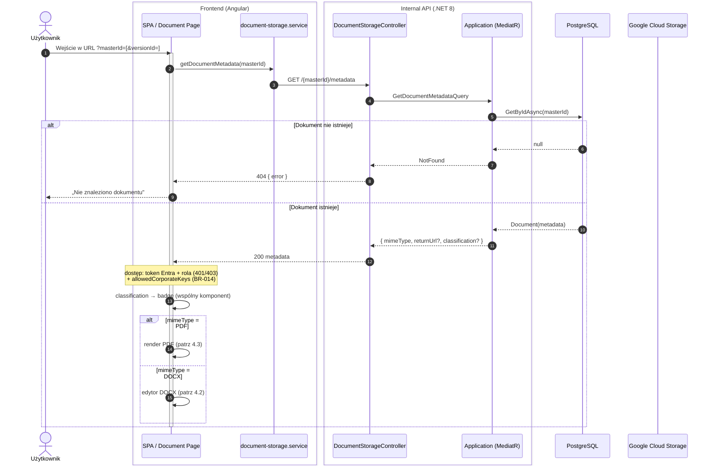
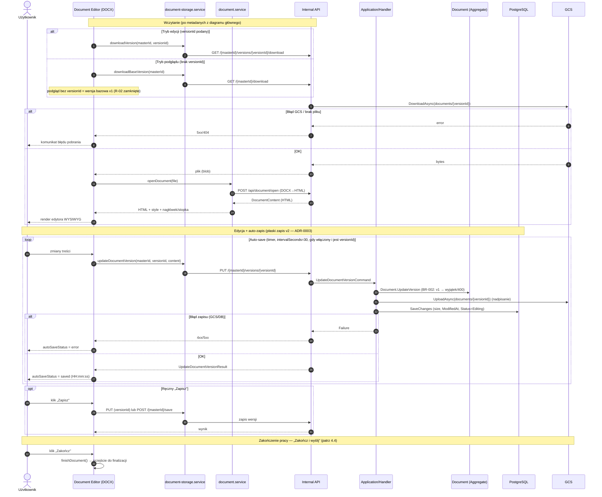
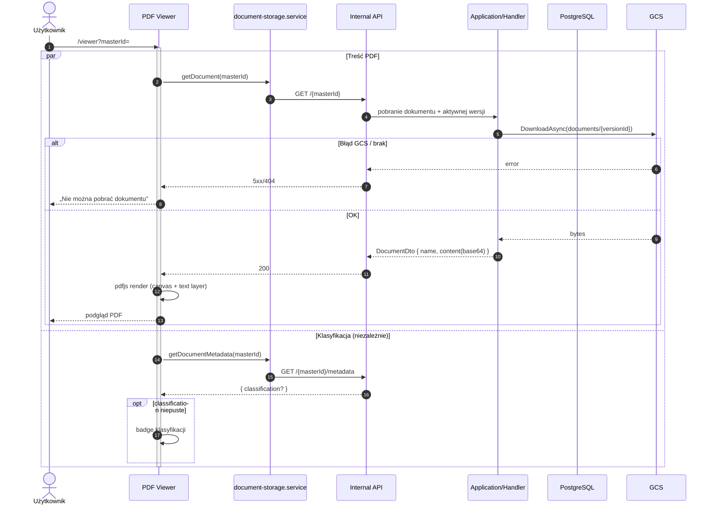
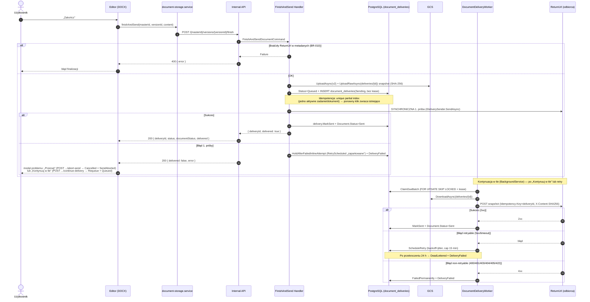

# Diagram sekwencji: cykl pracy z dokumentem

> Źródło prawdy: `.ai/` + kod (stan 2026-05-26; zaktualizowano 2026-07-05: auth Entra ID, synchroniczna 1. próba „Zakończ" — 200 zamiast 202, podgląd ładuje v1). Elementy niepotwierdzone oznaczono **[Wymaga potwierdzenia]**.

## 1. Cel diagramu

Diagram pokazuje realny przepływ pracy z dokumentem w D2 ViewerEditor: od wejścia w URL, przez pobranie metadanych i treści, rozdzielenie ścieżek DOCX/PDF, edycję z auto-zapisem, aż po „Zakończ i wyślij" (finalizacja + asynchroniczna wysyłka). Przeznaczony dla developerów, architektów, DevOps i integratorów.

## 2. Zakres procesu

- wczytanie dokumentu (metadane + treść/plik),
- rozdział ścieżek DOCX (edytor) / PDF (podgląd),
- prezentacja klasyfikacji z metadanych,
- edycja DOCX,
- auto-zapis (nadpisanie v2 w miejscu) i ręczny „Zapisz",
- zakończenie pracy: finalizacja + utworzenie zadania wysyłki + polling statusu,
- asynchroniczna wysyłka przez worker na `ReturnUrl`,
- obsługa błędów na kluczowych etapach.

## 3. Założenia i źródła

**Pliki `.ai`:** `ARCHITECTURE.md`, `API_CONTRACTS.md`, `DOMAIN.md`, `DATABASE.md`, `DECISIONS.md` (ADR-0003/0005), `SECURITY.md`, `PROJECT_CONTEXT.md`, `FEATURES.md`.

**Potwierdzone w kodzie:**
- `pages/pdf-viewer/pdf-viewer.ts` — load przez `getDocument(masterId)` + niezależny `getDocumentMetadata(masterId)` (klasyfikacja).
- `components/document-editor/document-editor.ts` — `loadFromStorage`: `getDocumentMetadata` → decyzja PDF/DOCX → `downloadVersion`/`downloadBaseVersion` → `documentService.openDocument` (POST `/api/document/open`); `finishDocument()` z pollingiem; `documentClassification` z metadanych.
- `services/document-storage.service.ts` — `updateDocumentVersion` (PUT), `finishAndSend` (POST `.../finish`), `getDeliveryStatus`.
- `Api/Controllers/DocumentStorageController.cs` — endpointy `finish` (200, synchroniczna 1. próba), `abort-send`, `continue-delivery`, `deliveries/{id}`, `deliveries`, `retry`, `cancel`, `recipient-url`.
- `Infrastructure/Services/Delivery/*` + `DocumentDeliveryRepository` — worker, claim `FOR UPDATE SKIP LOCKED`, wysyłka HTTP.

**Rozstrzygnięte po snapshotcie (2026-07-05):**
- **Sprawdzenie dostępu / autoryzacja** — zaimplementowane: token Entra ID + role `Operator`/`Administrator` (ADR-0022) + `allowedCorporateKeys` (BR-014); A-05 zamknięte. Adnotacje „brak warstwy auth" w diagramach poniżej są historyczne.
- Krok 2 (podgląd): ładuje v1 przez `downloadBaseVersion` (R-02 zamknięte).
- POST zwrotny: `multipart/form-data` — części `file`/`masterId`/`versionId`/`corporateKey` (`HttpDeliverySender`).

---

## 4. Diagram sekwencji

### 4.1 Diagram główny (wysoki poziom)



**Objaśnienie:** wspólny punkt startowy dla obu typów to pobranie metadanych. mimeType decyduje o ścieżce; klasyfikacja jest prezentowana niezależnie od typu pliku.

---

### 4.2 Ścieżka DOCX — wczytanie, edycja, auto-zapis, zakończenie



**Objaśnienie:** edytor pobiera plik z GCS, konwertuje DOCX→HTML przez bezstanowy `/api/document/open`, a auto-save nadpisuje tę samą wersję (v2) w miejscu — nie mnoży wersji.

---

### 4.3 Ścieżka PDF — podgląd + klasyfikacja



**Objaśnienie:** treść i metadane (klasyfikacja) pobierane są niezależnie — awaria metadanych nie blokuje renderu PDF, a brak/puste `classification` nie renderuje pustego badge.

---

### 4.4 Zakończenie pracy: finalizacja, zadanie wysyłki, worker



**Objaśnienie:** finalizacja jest atomowa (jeden `SaveChanges`: status dokumentu + zadanie). Wysyłany jest **niezmienny snapshot** zamrożony w chwili „Zakończ" (BR-012) — auto-save po zakończeniu nie zmienia wysyłanego pliku. Wysyłka jest at-least-once z `Idempotency-Key`.

---

## 5. Objaśnienie krok po kroku

**Wczytanie dokumentu:** GUI pobiera `GET /{masterId}/metadata`; brak dokumentu → 404. mimeType decyduje o ścieżce (PDF/DOCX); `classification` zasila wspólny badge.

**Sprawdzenie dostępu:** (zaktualizowane) całe Internal API wymaga tokenu Entra ID (401 bez tokenu) + roli aplikacyjnej `Operator`/`Administrator` (403, ADR-0022); endpointy treści/metadanych dodatkowo sprawdzają `allowedCorporateKeys` względem `CorporateKey` z claimu tokenu (403; admin omija — BR-014).

**Ścieżka DOCX:** pobranie pliku z GCS (`downloadVersion` w trybie edycji / `downloadBaseVersion` w podglądzie) → konwersja DOCX→HTML (`POST /api/document/open`) → render edytora.

**Ścieżka PDF:** `GET /{masterId}` (treść base64) → render pdfjs; metadane pobierane równolegle.

**Auto-zapis:** pętla `loop` (timer 30 s, tylko gdy włączony i jest `versionId`) → `PUT /{masterId}/versions/{versionId}` → nadpisanie v2 w GCS + `SaveChanges` (Status=Editing). v1 jest chroniona (BR-002).

**Zakończenie pracy:** `POST .../finish` → snapshot + **synchroniczna pierwsza próba** (200 `{ deliveryId, status, documentStatus, delivered, error? }`); sukces → `Sent`, błąd → decyzja użytkownika: `POST .../abort-send` (przerwij) lub `POST .../continue-delivery` (worker dokańcza w tle, retry do 24 h).

**Obsługa błędów:** 404 (brak dokumentu), 5xx/404 (błąd GCS/brak pliku), 4xx/5xx (błąd zapisu → `autoSaveStatus=error`), 400 (zły/brak `ReturnUrl` przy finalizacji), klasyfikacja błędów wysyłki (retry vs `FailedPermanently` vs `DeadLettered`).

---

## 6. Warianty procesu

| Wariant | Zachowanie |
|---|---|
| Dokument DOCX | edytor + auto-save + finalizacja (4.2, 4.4) |
| Dokument PDF | podgląd read-only + klasyfikacja (4.3) |
| Użytkownik bez dostępu | **[Wymaga potwierdzenia]** brak warstwy auth — obecnie nieobsługiwane odrębnie |
| Dokument bez klasyfikacji | badge nie renderuje się (brak/empty/whitespace) — brak błędu |
| Błąd GCS | komunikat pobrania; brak utraty danych |
| Błąd zapisu | `autoSaveStatus=error`; możliwy ręczny „Zapisz"/ponowienie |
| Zakończenie z wysyłką | DOCX z poprawnym `ReturnUrl` → zadanie + worker |
| Zakończenie bez `ReturnUrl` | 400 — finalizacja odrzucona (BR-010) |

---

## 7. Punkty integracyjne

**Endpointy (Internal API `/api/documentstorage`):** `GET /{masterId}/metadata`, `GET /{masterId}`, `GET /{masterId}/download`, `GET /{masterId}/versions/{versionId}/download`, `PUT /{masterId}/versions/{versionId}`, `POST /{masterId}/save`, `POST /{masterId}/versions/{versionId}/finish`, `GET /deliveries/{deliveryId}`, `GET /deliveries?status=`, `POST /deliveries/{deliveryId}/retry`. Bezstanowy: `POST /api/document/open`.

**Frontend:** `pages/pdf-viewer`, `components/document-editor`, `components/document-classification-badge`, `services/{document-storage.service, document.service}`.

**Backend handlery:** `GetDocumentMetadataQuery`, `UpdateDocumentVersionCommand`, `FinishAndSendDocumentCommand`, `GetDeliveryStatusQuery`, `RequeueDeliveryCommand`.

**Storage/DB/Worker:** GCS (`documents/{versionId}`, `deliveries/{deliveryId}`), PostgreSQL (`documents`, `document_versions`, `document_deliveries`), `DocumentDeliveryWorker`.

**System zewnętrzny:** odbiorca `ReturnUrl` (POST snapshotu z `Idempotency-Key`).

---

## 8. Rekomendacje dotyczące czytelności procesu

- **Dostęp:** (zrobione) auth Entra ID + role + `allowedCorporateKeys` — patrz `SECURITY.md`, ADR-0011/0012/0022.
- **Krok 2 (podgląd):** (zrobione) tryb read-only ładuje v1 przez `/download` (R-02 zamknięte).
- **Logi/correlation:** propagować `correlation_id` z `document_deliveries` do logów finalizacji i wysyłki dla śledzenia end-to-end.
- **Kontrakt zwrotny:** udokumentować `Content-Type`/body POST-u na `ReturnUrl` (potwierdzić w `HttpDeliverySender`).
```
